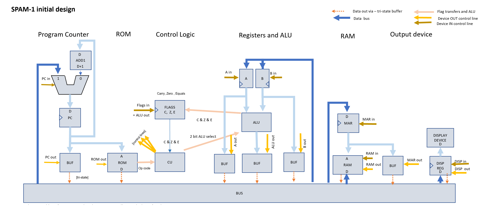
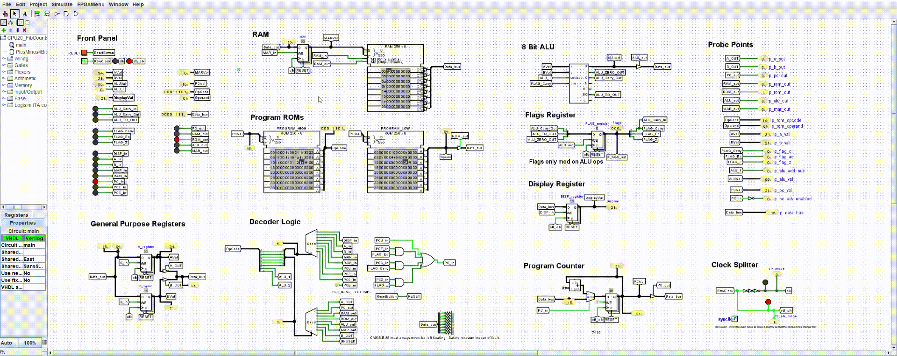
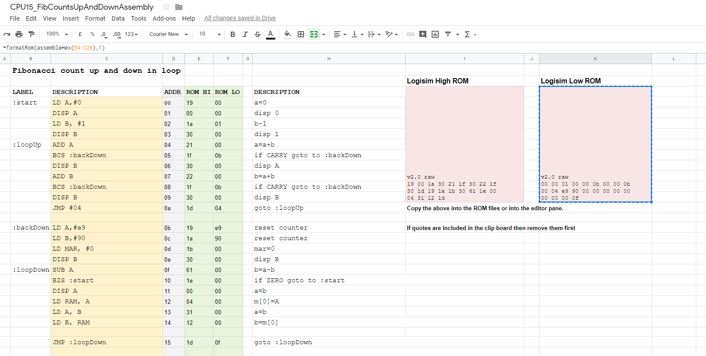
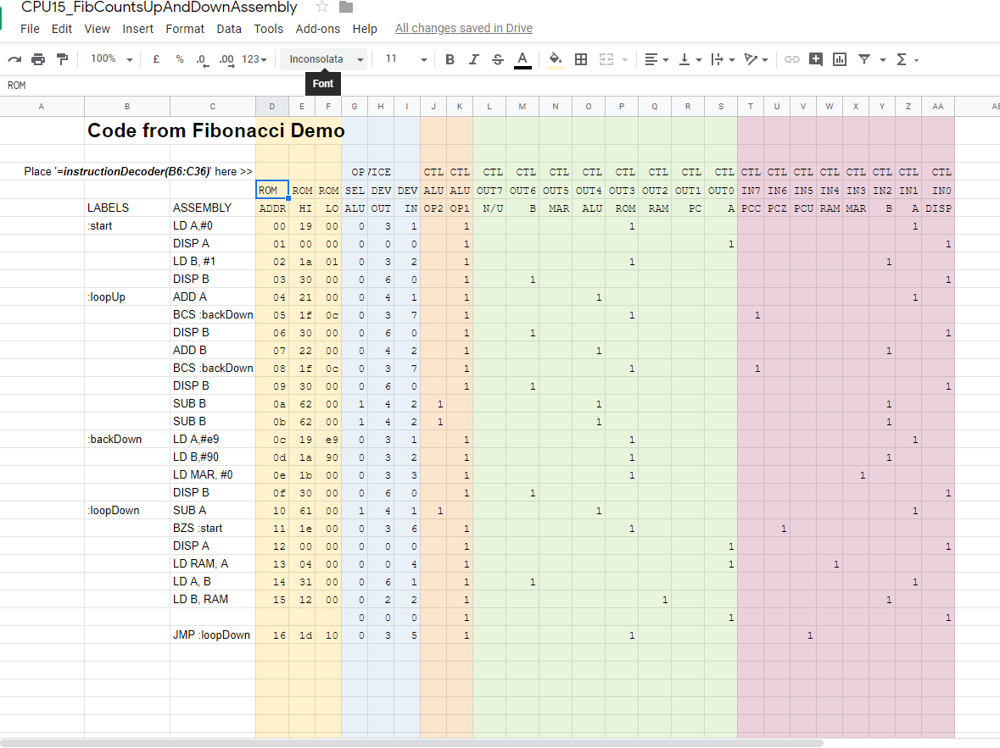
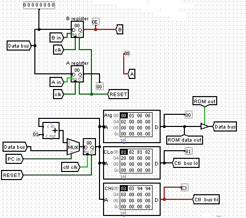
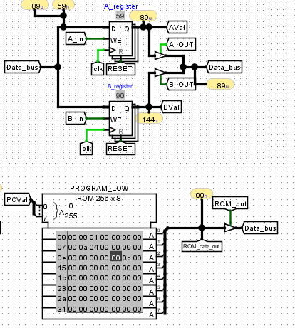
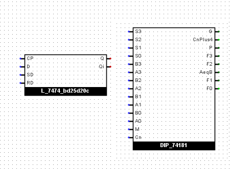
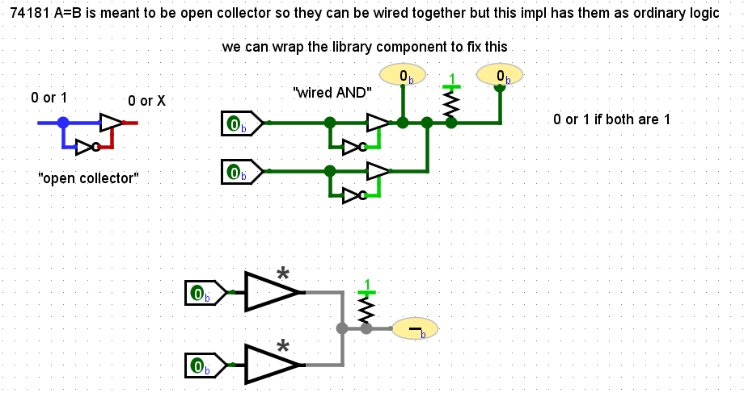

# SPAM-1 CPU - Simple Programmable and Massive

A Simple 8 bit home brew CPU built using 1970's logic chips.

Currently in simulation phase using Logism Evolution with Google Sheets based assembler.

Will move to hardware once the tool chain is resolved.

:thumbsup: See the [SPAM-1 Assembler](https://docs.google.com/spreadsheets/d/1lYyPqYNF1dGDRP2n3ablaqkgZuxJ9x6T-ylut_nT1p4/edit?usp=sharing) implemented in Google Sheets.  

## Other Pages


## Motivation

A bit of fun!

I started working life in 1986 as a hardware engineer but quickly switched to software. As a teenager I'dbeen fascinated with
discrete electronics and then later on with integrated circuits and build many little home projects; nothing too exciting as we didn't have the resources (ie ££) back then.

Recently, like many other folk, I came across [Ben Eater's series of YT videos](https://www.youtube.com/watch?v=HyznrdDSSGM&list=PLowKtXNTBypGqImE405J2565dvjafglHU) and also those of quite a few others that inspired me to have a go at building my
own CPU. Back in 1980 even the relatively few parts needed would probably have been beyond my means, but not anymore !!

However, back in the 1980's  I would have been building more or less blind. I still don't have an oscilloscope but what I do have is a simulator.   
Having spent the last few weeks getting to know [Logisim Evolution](https://github.com/reds-heig/logisim-evolution)  and having hours trying to figure out the fine details of my simulated processor
it's clear that if I had attempted to build a CPU back in 1980 then I'd have fallen flat on my face.
It's been a great learning experience, if frustrating at times.

So I've decided to build an 8 bit CPU for myself, for the sheer joy and nostalgia, sweat and tears.

# Objectives

- I want to be able to run at least the typical demo programs like Fibonacci 
- It will have an assembly langauge and assembler
- I want to simulate it first
- I want to build it physically, or a more likely a  derivative
- Attach some output device - eg a UART / tty that respects VT codes (or Graphics??)
- I might port or other higher level language to it for curiosity (which one and where to start?)
- I would like to extend it to play some kind of basic game (tbd)

:star: But I wanted to do things a little differently to some of the other efforts on the internet! I want the assembler and any other code I write to 
to be more readily accessible and instantly usable to others (like you) without installing python or perl or whatever first, so I've written the assembler in google sheets! 

# Architecture

- Single bus
- 8 bits data
- 8 bits address
- 16 bit instruction
- 8 bit ALU - add/subtract
- Separate RAM and ROM (for no particular reason - could have been all RAM)
- One instruction per clock cycle (effectively "Fetch/Decode" on falling edge of clock and "Execute" on rising edge of clock)
- Uses microcode instructions, not "microcoded" instructions, ie each instruction is at microcode level and directly enables the necessary control lines.
 Therefore control logic is trivial so unlike some other systems there is not EEPROM for control decoding and there is no Instruction Register either.
- Registers
  - A and B general purpose registers (GPR) - These are not symmetrical because "A" always comes first in arithmetic ie "=A+B" and "=A-B"
  - Memory Address Register (MAR)
  - Program Counter (PC)
  - Status (flags) register - Zero,  Carry, Equals (ie A=B)
  - Display register (also use for input?)
- Instructions for load any register with any other register, jump and branch, addition and subtraction - there's a surprising lot you can do with this and even without complex microcoded instructions



# Run the simulator

Works in Window 10 at least. I haven't tried running Logism yet on Linux but it's all Java. 

- Clone the git repository
- Change directory to _./logism_ subdirectory
- Run the logism evolution jar in the repo's _logism/_ subdirectory (or download the latest version from [the author's git repo](https://github.com/reds-heig/logisim-evolution)) 
- Load the circuit from the same directory
- Start the simulator. Menu -> Simulator -> Ticks Enabled

# Change the Assembly Program

- Open the [Simple CPU Assembler](https://docs.google.com/spreadsheets/d/1lYyPqYNF1dGDRP2n3ablaqkgZuxJ9x6T-ylut_nT1p4/edit?usp=sharing) implemented in Google Sheets

- Goto, or duplicate, the "Fibonacci Assembler Demo" tab 
- Make some changes to the Assembler
- Copy the ROM bytes from the pink cells on the right of that same page into your clipboard
- Place the data into the files on disk and then load into the ROMS or paste direct into the ROM's in Logism
    - Unfortunately the clipboard will have quotes in it so edit the clipboard in a test editor to remove the two quote.
    - If you are not writing the clipboard into a "rom file" the remove the "v2.0 header" from the clipboard contents too
 - Start the Logism simulator as above

## Program Storage

Program is stored in ROM and is, wastefully, a fixed 16 bit instruction, organised over a pair of ROMs, one each for for high and low byte of the instruction.
The high byte defines the operation and the low byte is used only for constants (at present) which is why I said it's wasteful.
 
### High ROM byte
The high order bytes is organised into three parts, identifying the ALU operation and the input and output devices.


- 2 "ALU" bits configure the ALU operation - only add/subtract right now.
- 3 "OUT" bits select one device (0-7) that will be enabled to output onto the bus.
- 3 "IN" bits select the device who's input register will be enabled to latch the value on the bus.
  
Therefore with this design I can have at most 8 "input" devices and 8 "output" devices (some ideas on improving this are below).

### Low ROM byte

This low order ROM is used only for program constants at present; this is rather wasteful (see below). 

### Example Program - Fibonacci

```
:start	    LD A,#0
            DISP A
            LD B, #1
            DISP B

:loopUp     ADD A
            BCS :backDown
            DISP A
            ADD B
            BCS :backDown
            DISP B
            JMP :loopUp
	
:backDown   LD A,#e9
            LD B,#90
            LD MAR, #0
            DISP B
:loopDown   SUB A
            BZS :start
            DISP A
            LD RAM, A
            LD A, B
            LD B, RAM
            JMP :loopDown                                                                                                                                                                                                
```

# Progress

I've spent a couple of weeks building the sim for a CPU. It's 8 bit and based on ideas from various places but kind of grew by itself with a little planning.
It's a fairly primitive one in that there is no opcode vs microcode, or to put it another way every instruction is microcode. Also, this approach meant I never
got around to needing to add an instruction register.

:star: The complete set of instruction and argument combinations are [here](docs/instructions.txt)

- The simulator works
- The assembler and decoder work (see below) and I'm happy with the way the software turned out
- My Fib program counts up and down in a loop

So all good !!


# Documentation

## Simulated in Logism Evolution 



## :thumbsup: I've built an assembly language for it and also an assembler.

I've built the assembler in Google Sheets, which I think might be a pretty unique approach (let me know).

 
    
## Todo

Keep going .

## Try my CPU and Assembler for yourself

You can then download the Logism jar plus my circuit files and the rom images and run it. You can play with the assembler and 
put your own programs into the ROMs for a giggle.  
 
There is also an "instruction decoder" page which will decode the assembly program and show you which control lines are enabled for each instruction in the program.



# Improvements

## Better use of ROM

My use of a fixed 16 bit instruction word is quite wasteful. Unless I'm dealing with a constant then the second ROM is entirely unused.
One solution is a variable width 8 bit instruction where most instructions are 8 bit, but when ROM_out is enabled in the first byte 
then the control logic looks for the operand in the subsequent byte.

## Immediate arithmetic

At present I can only interact with the ALU via the A/B registers. This means I can't do arithmetic
 on a value from the ROM or RAM without wiping one of those two registers. I can of course mux the data bus into the
 ALU, however, a problem with getting a value from RAM into the ALU 
  and capturing the result of the arithmetic is that I only have one bus and I can't have both the RAM active out on the BUS
 whilst also having the ALU active out. A solution might be to put a register on the output of the ALU so that I can do the arithmetic in
 one micro-instruction and then emit the result in the next micro-instruction. 
 
## CALL and RET

I'd like to demonstrate a call to a subroutine and a return from that call. 

All my instructions are micro-instructions and doing a "CALL" requires at least two micro-instructions, one to push the PC into RAM then another to move the PC to 
the new location. So I don't think I have the luxury of being able to introduce an "CALL" op code in the hardware. However the assembler could certainly expand a 
"CALL :label" into something like this (note: typically one places a stack at the end of memory and works backwards through RAM as items are pushed to the stack- I've used that approach below). Notice that both A and B registers get trashed in the Call and Ret so can't be used for passing arguments to the subroutine. Having an auto-incrementing SP (more like PC) and auto-decrementing SP would save a bunch of instructions and also avoid trashing the two registers.

What call convention do I want???? Stack or Register?
In this design there isn't a SP register just a defined location in RAM.
 

```
#### CALL
#Assembler has to work out where the call will return to, i th address directly after the call code below, and '<PC RETPOINT>' signifies that address.

# store "PC RETPOINT" into the stack
    MAR=#SP_LOCATION   #set the MAR to point at the location of the SP
    MAR=RAM            #move the MAR to point at the value of the SP - ie into the stack
    RAM=<PC RETPOINT>  # stash the return location onto the stack

# advance the stack pointer 
    MAR=#SP_LOCATION
    A=RAM              #a=the value of the SP
    B=1
    ADD A              #a now SP+1
    RAM=A              #SP now incremented

# Jump to subroutine
    PC=#SP_LOCATION

#### RET

# decrement stack pointer
    MAR=#SP_LOCATION
    A=RAM              #a=SP
    B=1
    SUB A
    RAM=A              #SP now decremented

# Return from subroutine
    MAR=#SP_LOCATION
    MAR=RAM            #move MAR to point at the value of the SP - ie into the stack
    PC=RAM             # execution continues at new PC
    
```

And "RET" could be expanded to.  


```
# increment stack pointer
    A=RAM[#stackpointer_location]
    B=1
    ADD A
    RAM[#stackpointer_location]=A

# retrieve stack pointer into the PC
    MAR=RAM[#stackpointer_location]     #set the MAR to point at the current location of the SP
    PC=RAM
```

If passing args to the subroutine then they would also need to go into RAM and I could add a "PUSH" instruction to the Assembler to support this.

Where other processors have high level instruction built into the hardware and the control logic decodes this into micro-instructions,
 in my case the high level instructions would be merely a feature of the assembler and the assembler would "compile" these into the 
 micro-instructions that my CPU uses.
 
On a more traditional CPU a binary program (eg ".exe" or ELF executable) could work on multiple CPU types with different underlying CPU hardware and micro-instructions
as long as the CPU's all support the same set of "high level" Opcodes. The CPU's control logic takes care of translating the high level opcodes into the internal 
 micro-instruction language of the CPU. However, in my case that translation is happening in the assembler and if there is a change to the hardware
 then this renders all programs inoperable; there is no abstraction to save me.
 Of course I can just recompile the assembler to resolve the issue, however, this goes to highlight the power of high level op codes and embedded micro-code where no 
 recompilation is necessary (eg Intel vs AMD).  

Using the assembler to compile high level opcodes I can add things like ..

```
CALL :subroutine
RET 
PUSH <some register>
POP <some register>
INC <come register>
DEC <come register>
```           

## Save a control line by memory mapping the Display device

The display register steals a control line. In principal this could just be mapped to a specific memory location which would free up the control line
for something useful, for instance doubling the number if Input or Output devices on the bus. This might for instance allow me to implement Branch on Equals.
Though to be fair I have two selector lines going into the ALU and use only one of them at present so I could co-opt that if I wanted.

## Add more ALU operations

- Add logical operations.
- Add a shift left/right to the ALU (same as multiply by 2, div by 2)
- Add BCD operations

This is a biggie.

Having no logical operations at all is far from ideal.

But this would mean feeding at least three selector lines into it, which could give me 8 potential operations rather than the two I have currently implemented. 
However, I am already short on control lines so this isn't too appealing. If I switched to variable length instructions or added a register to 
the output of the ALU then perhaps I could get a lot more flexibility. Dunno.

Alternatively I could do something like add an 8 bit register for the ALU config, eg giving me 256 possible ALU operations. Or I could organise the 8 bit register 
 as 4 bits for multiplexing the inputs and output of the ALU, and 4 bits for the selection of the ALU operation. If I multiplex the inputs and outputs 
 of the ALU then I could do something like having a 4x8bit register file rather than just A and B and I could multiplex the RAM or ROM or whatever into the 
 ALU overcoming the register trashing  problem mentioned earlier.

Or perhaps the variable length instruction idea could yield benefits by giving me another 8 bits for control logic.

Obviously, being able to simulate all this before building is fantastic.

Considering basing the future ALU on a similar set to that used by [CrazySmallCpu](https://minnie.tuhs.org/Programs/CrazySmallCPU/description.html) ...
```
The ALU can perform sixteen operations based on the A and B inputs:
A + B decimal
A - B decimal
A & B
A | B
A ^ B
A + 1
Output 0, flags set to B's value
Output 0
A + B binary
A - B binary
Output A
Output B
A * B binary, high nibble
A * B binary, low nibble
A / B binary
A % B binary
```

Might use a ROM for the ALU. But haven't figured out with a single 8 bit wide ROM how to get a carry bit which would be necessary for chaining arithmetic to achieve arbitrary length additions. 
Perhaps this will require two 8 bit ROMS operating in 4 bit chained mode, or perhaps revert to using 4 bit arithmetic and chain operations in software? Not sure.

On the other hand I have two reclaimed [74181](http://ee-classes.usc.edu/ee459/library/datasheets/DM74LS181.pdf) ALU's in my desk - I think I should use those for nostalgia reasons.
I don't get BCD arithmetic with the 74181 but I do get to use the same type of chip that went went to the moon. Hooking it up fully would take 5 control lines plus the carry in. 
Hmm, I don't think I have the "LS" version which only pulls 20-40mA. The SN74181N that I have pulls a horrible amount of current according to the datasheet; 88-150mA.

  
## Write a C compiler

Yep - a C compile - others have done it.

Hmm. 
- Or perhaps [PL/0](https://www.youtube.com/watch?v=hF43WUd8jrg&list=PLgAD2y-6wgwoTnPfZWhMuXID14xnzkz2x)??

- https://github.com/DoctorWkt/smallc
- http://www.cpm.z80.de/small_c.html


## Hardware Components

### Presettable Counter Regsters

  NB 74160/74162 seem hard to find

- [74HCT161](http://www.ti.com/lit/ds/symlink/cd74hct161.pdf)  4-bit presettable synchronous binary counter; with Asynchronous reset (Error in data sheet - these are not decade counters)

- [74HCT163](http://www.ti.com/lit/ds/symlink/cd74hct161.pdf)  4-bit presettable synchronous binary counter; with Synchronous reset (Error in data sheet - these are not decade counters)

- [74HC160/74HC161/74HC162/74HC163](http://www.edutek.ltd.uk/Binaries/Datasheets/7400/74HC161.pdf) - 74LS160/74LS160 are BCD and 74LS161 and 74LS163 are binary 

- [74LS160A/74LS161A/74LS162A/74LS163A](http://www.sycelectronica.com.ar/semiconductores/74LS161-3.pdf) - 74LS160/74LS162 are BCD and 74LS161/74LS163 are binary & the 'A' variant has fewer electrical restrictions

### Registers

- [74HC377](https://assets.nexperia.com/documents/data-sheet/74HC_HCT377.pdf) 8 bit reg - convenient pin out at sides 

- [74HCT670](http://www.ti.com/lit/ds/symlink/cd74hct670.pdf) - 4x4 register file with simulataneous read/write - but not synchronous so probably need to add edge detect to it. Not common but [Mouser has 74HCT670](https://www.mouser.co.uk/ProductDetail/Texas-Instruments/CD74HCT670E?qs=sGAEpiMZZMutXGli8Ay4kCmqQhNNfHG%2FfP%252B1EEY4uvo%3D) in DIP package 

### Binary Counter / Register - Shared In/Out - curiosity

- [Understanding the 8 bit 74LS593 - Warren Toomey](https://minnie.tuhs.org/Blog/2019_04_26_Understanding_74LS593.html)
 with referenences to his successor to CrazySmallCPU called [CSCvon8](https://github.com/DoctorWkt/CSCvon8)

- [74LS592/74LS593](https://www.zpag.net/Electroniques/Datasheet/SN74LS592N.pdf) 8 bit binary counter, 74LS593 has shared In/Out and tristate 

### Shift registers

- [74HC165 using the parallel in / serial out shift register](https://iamzxlee.wordpress.com/2014/05/13/74hc165-8-bit-parallel-inserial-out-shift-register/)

- [74HC165](http://www.ti.com/lit/ds/symlink/sn74hc165.pdf) 8-Bit parallel in or serial in, with serial out Shift Registers

- [74HC585](http://www.ti.com/lit/ds/symlink/sn74hc595.pdf) 8 bit serial in parallel out shift reg - 3 state - with built in D type output latch 

- [74HCT4094](https://assets.nexperia.com/documents/data-sheet/74HC_HCT4094.pdf) 8 bit serial in with serial or parallel out

- [74LS674](http://www.ti.com/lit/ds/symlink/sn74ls673.pdf) 16 bit parallel in, serial out shift register

- [74LS673](http://www.ti.com/lit/ds/symlink/sn74ls673.pdf) 16 bit serial in, parallel out shift register

### Buffers 

- [74HCT245](https://assets.nexperia.com/documents/data-sheet/74HC_HCT245.pdf) Octal transceiver - 3 state. Has convenient pinout than the [74HCT244](https://assets.nexperia.com/documents/data-sheet/74HC_HCT244.pdf)

### ALU

- [Using the 74181](https://www.youtube.com/watch?v=Fq0MIJjlGsw)

- [74LS382](http://digsys.upc.es/ed/components/combinacionals/arithmetic/74LS381.pdf) 4 bit ALU with Cn+4 (74LS381 needs 74LS182)

### VGA 

- [NovaVga](https://static1.squarespace.com/static/545510f7e4b034f1f6ee64b3/t/56396b06e4b0dbf1a09516d5/1446603526737/novavga_rm.pdf) VGA adapter with frame buffer

- See also the "Propellor" range eg http://dangerousprototypes.com/blog/2012/06/09/parallax-propeller-retro-pocket-mini-computer/

- [MicroVGA](http://microvga.com/) - text only I think

- [VGATonic](https://hackaday.io/project/6309-vga-graphics-over-spi-and-serial-vgatonic)

### Breadboard

- [Bus Board Systems BB830](https://www.mouser.co.uk/ProductDetail/BusBoard-Prototype-Systems/BB830?qs=sGAEpiMZZMtgbBHFKsFQgkU9HqdjFsiq3piHUASHS%252BU%3D)

[Ben Eater discusses this board](https://youtu.be/HtFro0UKqkk?t=810) and also fakes. There is also a great YT video by someone else that compares the various bread board brands. 

Mine come from Mouser, a distributor for Bus Board.
But mine look different to those Ben used. Mine have "_BusBoard.com_" in a small font at one end, as [shown on the manufacturer's website](https://www.busboard.com/BB830). Ben's do not have the URL but Ben's do seem to match the [image shown on Mouser](https://www.mouser.co.uk/images/busboardprototypesystems/lrg/bb830_SPL.jpg) and also on the [BB830 data sheet on Mouser](https://www.mouser.co.uk/datasheet/2/58/BPS-DAT-(BB830-KIT)-Datasheet-1282386.pdf). 

Presumably the design of the board has changed slightly since 2016; lets hope the change is cosmetic and doesn't impact the quality of the boards. This diversity in appearance might make it more difficult to identify genuine parts. 

# Further reading and links

I'd also encourage you to look at [Warren Toomey's CrzySmallCPU](https://www.youtube.com/playlist?list=PL9YEAcq-5hHIJnflTcLA45sVxr900ziEy) and [James Bates' series](https://www.youtube.com/watch?v=gqYFT6iecHw&list=PL_i7PfWMNYobSPpg1_voiDe6qBcjvuVui) of  Ben Eater inspired videos for his build.

I found these discussion much more detailed in many cases and very useful. 

## Ben Eater's links

https://www.youtube.com/watch?v=AwUirxi9eBg&list=PLowKtXNTBypGqImE405J2565dvjafglHU&index=35 - Control signal overview

https://youtu.be/dXdoim96v5A?list=PLowKtXNTBypGqImE405J2565dvjafglHU&t=463 - Control logic 1 - Step by step control logic

https://www.youtube.com/watch?v=X7rCxs1ppyY&t=4m29s - Control logic 2 - Ben Eater comment on clock sync, the need for a separate ("inverted") clock for the enablement of registers, and also the need to do enablement of registers ahead of the synchronous clock - his solution is to buffer the clock line so that it is delayed by some nanoseconds compared to the clock used for register enablement.   

https://www.youtube.com/watch?v=ObnosznZvHY&list=PLowKtXNTBypGqImE405J2565dvjafglHU&index=43 - CPU Flags

https://youtu.be/ObnosznZvHY?t=709 - Ben discusses problem where the subsequent Jump instruction needs the Carry but the previous microinstruction wiped it out. Needs flags register to fix.

https://youtu.be/ObnosznZvHY?t=1164 - Copy flags from ALU to reg whenever doing a "Sum out" ie whenever the ALU is being outputted.


## Warren Toomey -  Crazy Small Cpu

https://minnie.tuhs.org/Programs/CrazySmallCPU/ Home page

https://www.youtube.com/playlist?list=PL9YEAcq-5hHIJnflTcLA45sVxr900ziEy Playlist for the Crazy Small CPU

https://www.youtube.com/watch?v=zJw7WcikX9A RAM and flags

https://minnie.tuhs.org/Programs/UcodeCPU/index.html Original Logism impl of the CSCv1


## James Bates links

https://www.youtube.com/watch?v=AALVh39X3xw&list=PL_i7PfWMNYobSPpg1_voiDe6qBcjvuVui&index=3#t=4m52s  Mentions "extensions to Bens video"

https://www.youtube.com/watch?v=AALVh39X3xw&list=PL_i7PfWMNYobSPpg1_voiDe6qBcjvuVui&index=3#t=5m15s  Bus and no need for pulls up/downs on bus in his case 

https://www.youtube.com/watch?v=AALVh39X3xw&list=PL_i7PfWMNYobSPpg1_voiDe6qBcjvuVui&index=3#t=6m30s  Discussion of program counter & bus width; Ben has 4 vs this 8

https://www.youtube.com/watch?v=hRJO97PbPlw&list=PL_i7PfWMNYobSPpg1_voiDe6qBcjvuVui&index=4#t=43m30s Need to pulse the write as this isn’t synchronous ram

https://www.youtube.com/watch?v=hRJO97PbPlw&list=PL_i7PfWMNYobSPpg1_voiDe6qBcjvuVui&index=4#t=46m09s Clock pulse and edge detector - Enable AND Rising Edge of clock via RC net ( Schmitt trigger??)

https://www.youtube.com/watch?v=hRJO97PbPlw&list=PL_i7PfWMNYobSPpg1_voiDe6qBcjvuVui&index=4#t=49m09s Discussion on the need to buffer the clock before James' edge detection signal to avoid pollution of the raw clock

https://www.youtube.com/watch?v=tUXboOaisAY&list=PL_i7PfWMNYobSPpg1_voiDe6qBcjvuVui&index=5#t=27m59s Good discussion on instruction encoding (compression) in 8 bits

https://www.youtube.com/watch?v=DfuFNBJn1hk&list=PL_i7PfWMNYobSPpg1_voiDe6qBcjvuVui&index=6#t=6m48s Fixes one of the operands to reduce instruction space B is always second input   so can’t do A=C+D

## Simple CPU

http://www.simplecpudesign.com/ Home page

http://www.simplecpudesign.com/simple_cpu_v1/index.html  V1

http://www.simplecpudesign.com/simple_cpu_v1a/index.html V1a V1a

http://www.simplecpudesign.com/simple_cpu_v2/index.html   V2

## Gigatron

https://hackaday.io/project/20781/logs?sort=oldest&page=2

## CPU Architecture

### Register vs Accumulator vs Stack based architectures

- [YCombinator question](https://news.ycombinator.com/item?id=16900113)

    But generally, things fall out this way:

    1) register based

    Has a pool of registers, and the registers are general purpose (meaning they can be used as source or destination for most any computation operation the CPU can perform).

    2) accumulator based

    Has a "dignified" register (the accumulator) and most computations only happen in/out of the accumulator. Other registers exist for more specialized purposes to facilitate feeding data into and out of the accumulator. Many DSP architectures are very highly "accumulator based". General purpose CPU's, less so unless you go back in time to late 70's or early 80's architectures.

    3) stack based

    Has no registers (or very few) other than a stack pointer. All temporary data is stored on the stack, and all computation instructions involve computing with data items at the top of the stack and returning the result to the top of the stack.

- [Quora question refines the above](https://www.quora.com/What-is-the-difference-between-accumulator-based-cpu-and-register-based-cpu)

    Within general purpose register machines, there are multiple varieties as well:  (This list is not exhaustive; also, some architectures blend these concepts.)

    - Register-Memory:  One operand comes from a register, and one operand  comes from memory.
    - Register-Register, 2-address:  Both operands come from registers, but the result must overwrites one of the inputs.
    - Register-Register, 3-address:  Both operands come from registers, and the result can go to its own register.
    
    The x86 processor, for example, is a Register-Memory machine that also offers 2-address Register-Register instructions.  Most RISC machines are 3-address Register-Register machines, with separate load/store instructions.  Both are general-purpose register machines.

    Compare those to the 6502, which is an accumulator machine.  Most arithmetic (addition, subtraction, rotates and shifts) operates on the A register.  The two other registers, X and Y, only support increment, decrement and compare; they're mainly used for indexing memory and loop counters.

- [HP 3000 Stack based](https://en.wikipedia.org/wiki/HP_3000#Use_of_stack_instead_of_registers)


### [Doing binary arithmetic](https://www.youtube.com/watch?v=WN8i5cwjkSE)

### [What we mean by Carry and Overflow](http://teaching.idallen.com/dat2343/10f/notes/040_overflow.txt)

## Other Computers

https://github.com/DoctorWkt/CSCvon8/blob/master/Docs/CSCvon8_design.md

https://hackaday.io/project/24511-jaca-1-2-homebrew-computer

https://minnie.tuhs.org/Programs/CrazySmallCPU/description.html


 


## Simulators

[Logisim (original)](http://www.cburch.com/logisim/) is no longer supported however there seems to be a lot of reusable circuits out there for it (eg github). 
I started building in Logisim "original" and got a long way. However, at one point I was having difficulty with something and
I went investigating and only then discovered that it was no longer under development. Apparently the author had decided to go off and build a new shiny product 
but that project ran out of steam and never materialised. In the mean time Logism went stale. 
Fortunately however, Logisim "original" was adopted by [Reds Institute](http://blog.reds.ch) and was reborn as "Logisim Evolution".
 
[Logisim Evolution](https://github.com/reds-heig/logisim-evolution) is a fork that has added many features and also fixed various problems apparently.
It's worked pretty well for me. It's not perfect and a bunch of the UI interactions are non-intuitive but on the whole it works pretty well. Occasionally 
the simulation engine inside it crashed and I had to restart but the app told me to save and restart and this always worked fine without any loss of work so it wasn't
 much of an inconvenience. 

Unfortunately, there seems to be a bit of fragmentation in Logism as there appear to be a further two "active" forks.

[Cornell fork of Logism Evolution](https://github.com/cs3410/logisim-evolution) which is used by their [computer science course](
http://www.cs.cornell.edu/courses/cs3410/2019sp/labs/lab1/).
 
As a user of logism I don't welcome forks. I have to choose which to use.
I'm not sure what the incompatibilities might be, there might be features in either that I want. Its unclear which fork 
has the best chance of support and development going forward.

As a user I'd prefer it if all these clever folk pooled their resources into one mighty version of Evo.
The forking risks leaking resources away from the product generally and damages reputation.

### Upgrading from Logisim Original to Evolution

Upgrading wasn't trivial, buit wasn't too difficult either. Unfortunately, "original" and "evo" are not 100% compatible from an upgrade perspective. It seems that the problems occur if using the "memory" components like RAM, ROM and register for instance
 as these have changed in the "evo" dist.   

:thumbsup: The [video from MrMcsoftware](https://www.youtube.com/watch?v=yd7DeWTbfWQ) was incredibly helpful in giving me my first pointers on how to sort out the issues
without starting from scratch. It does mean editing the "circ" file in a text editor but the changes were pretty straightforward. Pity there isn't a better written guide to this.

One gripe myself and [MrMcsoftware](https://mrmcsoftware.wordpress.com/author/mrmcsoftware/) have in common is our dislike of the clunk ROM and RAM figures used by Evo.
The new images take up a lot more space needlessly.
I think they are some kind of ANSI rendition of the component - see the document [_"Texas Instruments paper Overview of IEEE Standard 91-1984 - 
Explanation of Logic Symbols "_](http://www.ti.com/lit/ml/sdyz001a/sdyz001a.pdf) (also copied into the docs folder of this repo).

MrMcsoftware has a replacement library (ForEv.jar) but I decided just to accept the change.
Another, gripe is that the rendering in evo is much chunkier so less seems to fit in the same area.
I find the original rendering much more pleasing to the eye, however, there are sufficient improvements in evo to persuade me to accept these changes.

For comparison: Original vs Evolution ...




### Logism Libraries

In the end I didn't use any libraries (yet) and used just the build in components, however I spent ages faffing about looking at them.
When I come to moving to hardware I may go looking for libraries then, I don't know, at that point I might try one of the other simulators.   

In any case my thought on libs follow ..
 
I wasn't able to find a good resource listing the various libraries that exist out there in github and elsewhere. Whether a given library works in original or evolution 
is uncertain until you actually try it. Many "original" circuit libs do work functionally in evolution but often the rendering of the component in evolution is utterly 
different than in the original product. My guess is that evo often ignores the rendering info in libraries from original and just renders a big clunky default.

For example is what you get if you import the 7477 from [stsvetkov](https://github.com/stsvetkov/L8cpu). To be fair this library doesn't pretend to be evo-compatible, but below you can see that the 747D latch gets rendered as some kind of evo default rendering.
Also, notice the mangled chip name "L_7474_bd25d20c. This name mangling is a feature of the auto upgrade that evo does to incompatible files from original. This name mangling typically occurs
when the name in the library breaks one of evo's name rules. Evo substitutes a valid name instead. This name mangling doesn't seem to mess with the functionality however.
In anycase if there is a library you like and want to use then you can always copy the file and edit it to remove offending characters like whitespace and hyphen.
You will still get a chunky glyph however then names will be more sensible. For contrast below you can see the 74181 from the same library after I've fixed various naming issues. 



What worked for me where I didn't like the appearance of a component was that I imported it into Evo into a sub circuit and then I edited the appearance of the subcircuit in evo to make it
smaller and more convenient. This approach doesn't of course work for the chunk ROM and RAM I mentioned earlier because they have interactive UI's that I'd end up hiding
if I wrapped it and hid it inside a subcircuit. Anyway, it's worth considering.
     
Another, gripe with some libs is that they aren't accurate. In at least two cases I found for instance that outputs that were documented in the datasheet as "open collector"
had been implemented with regular logic; the 74181 "A=B" output is an example. It's not that hard to fix this if you wrap the component with output 
buffered as shown below


Here's an example of usage of open collector outputs connecting in a "wired and" configuration ...
 


I ended up putting the open collector buffer component into a subcircuit and then created an "appearance" for it in Evo's appearance editor that looks like a buffer with an asterisk next to it. 
I understand this is the correct icon for such.

### Getting Logism Evolution

See the downloads in guthub https://github.com/reds-heig/logisim-evolution/releases
  
  
### Yet more Simulators

[circuitverse](https://circuitverse.org/)   

Can't recall why I was put off by this product.
 
It's online which is cool but for some reason when I was playing originally I got stuck and gave up.
There does seem to be a community of project folk have worked that you can form and extend.
Loads of existing circuits to play with and learn from.
Looking again just now after having spent two weeks with Evo I think CircuitVerse looks pretty decent; however I still can't work out how to make CircuitVerse's plot feature work (Logism's Cronogram was useful to me).  
So, CircuitVerse might be worth considering.

   
[Digital](https://github.com/hneemann/Digital)

Seems like a cousin of Logism and is actively supported too. 
The author responded very quickly to comments I made on an old closed ticket!.
I think I'd already started with Logisim by the time I discovered Digital.

Rather like Logisim this product is merely a jar you download and run; so it's not online.

The author provides a bunch of history on Logism that illustrates the fragmentation in the Logisim space. 

Digital's author says that he fixes a bunch of the long standing architectural issues in all variants of Logism.

The author also states that error detection in Digital is better than Logism. 
Any improvements in that space are a definite plus. 
It's a huge pain sometimes trying to figure out where an oscillation is coming from or where there's transient conflict 
on a level on a wire.

I found the UI interactions unintuitive at times. I couldn't work out how to reroute a wire without deleting it.

There's a lot of cool stuff in there including documentation on extending Digital. Docs on Logism are a bit lacking or fragmented.
I particularly like the claimed 80% test coverage. I understand Logism also lack good automated testing. 

Again probably worth a look.

Given Digital's connection back to Logism it's a pity there's no way to import a Logism circuit :(

UPDATE: 11 Aug 2019 - went back and had a play with Digital. I found it difficult to work with. Specifically there is no convenient way to paste contents into the ROM component (unlike Logism Evo) so you have to edit each byte in turn or use a file. I was able to entry multibyte values despite it being an 8 bit wide EEPROM. Eventually the program errored with a null pointer exception (I have reported stack trace). So I don't think I'll be going back again for now. 

