# SPAM-1 CPU - Simple Programmable and Massive

An 8 bit home brew CPU built using 1970's logic chips.

This project is currently in it's 3rd incarnation. 

## CURRENT Design - Version 1c 

I'm currently working on what I hope is the final version.

This version has a 48 bit instruction word spread across 6 ROM's. It's 48 bit instruction is read in a single clock cycle to avoid having to introduce instruction registers
plus it's faster that way. The other big change is that I've included a bunch of features that are intended for exploration and learning such as including different kinds of 
registers including common 8 bit flipflops plus a 74HCT670 register file, and also by having 5 buses!

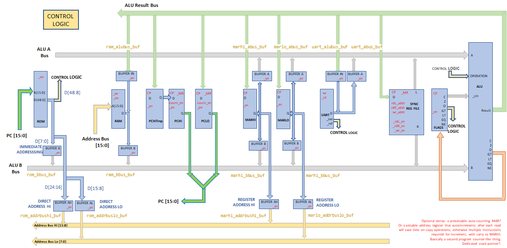

### Previous Versions

See [Previous Versions](docs/previous_versions.md) of the architecture.


# Motivation

A bit of fun!

I started working life in 1986 as a hardware engineer but quickly switched to software. As a teenager I'd been fascinated with
discrete electronics and then later on with integrated circuits and built many little home projects; nothing too exciting as we didn't have the resources (ie ££) back then.

Recently, like many other folk, I came across [Ben Eater's series of YT videos](https://www.youtube.com/watch?v=HyznrdDSSGM&list=PLowKtXNTBypGqImE405J2565dvjafglHU) 
and also videos of quite a few others that inspired me to have a go at building my
own CPU. Back in 1980 even the relatively few parts needed would probably have been beyond my means, but not anymore !!

However, back in the 1980's I would have been building more or less blind. I still don't have an oscilloscope but what I do have
 is a Verilog simulator. (Update 2020: bought a 2 channel oscilloscope, a Siglent "SDS1102CML+" Dual-Channel Bench Oscilloscope 100 MHz for £283 inc VAT and delivery)   

Back at the start of this project I spent a few weeks getting to know [Logisim Evolution](https://github.com/reds-heig/logisim-evolution)
 and having spent hours trying to figure out the fine details of my simulated processor
it's clear that if I had attempted to build a CPU back in 1980 then I'd have fallen flat on my face.
It's been a great learning experience, if frustrating at times.

So I've decided to build an 8 bit CPU for myself, for the sheer joy and nostalgia, sweat and tears (almost literally).

Gradually, I've extended the design extensively and have chosen to simulate the whole thing in Verilog
(thanks to advice from [Warren Toomey](https://github.com/DoctorWkt)) using accurate propagation 
delays to hopefully tease out timing errors (I don't own an oscilloscope!).

Leaning verilog and reworking most of the design has taken months, but as of June 2020, I've finalised the
 verilog and will have a go at writing various programs to prove out the design and test it's capabilities.

# Objectives

-  I want to build something non-trivial with direct and immediate addressing capabilities for variety
-  I want to use it as a vehicle for learning about lots of stuff including register files and other curiosities plus instruction set design, some lesser known chips, and so on
-  I originally wanted to be able to run at least the typical demo programs like Fibonacci, but that proved pretty trivial and was done in version 1a as a program on the Logisim version
-  I will write an assembly language and assembler 
-  I will create some kind of higher level language compiler
-  I want to simulate the hardware entirely first, using verilog
-  I want to build it physically, or a more likely a derivative (update 2020: it has turned out to be a distant derivative of the original design)
-  I want to attach some output devices - eg a UART / tty that respects VT codes
-  I want to hook it up to a basic graphics output using VGA - stretch
-  I would like to extend it to play some kind of basic game (update 2021: I've got the simulator running a Chip8 emulator over the simulated UART onto a terminal)
-  I want to finally complete it during 2020 (please!!!  update 2021 : failed on this big time!)

:star: In the very early stage of my learning I wrote an assembler in Google Sheets. I was looking to see what could be done without installing tools python or perl or whatever first!  
However, further development of the design really required more powerful tooling such as Icarus Verilog as well as Scala/Python after all.

My development environment is still pretty accessible as I use Windows 10 running the Windows Subsystem for Linux. 
So I have a full Linux environment without the need to install a virtualisation software like VirtualBox and it all just works very sweet. 
The integration between Windows 10 and WSL is brilliant, and I use the same environment for all opensource coding I do these days. 
I wish I could use it at work frankly.

I will at some point do a video on setting up the tooling as it's generally useful I feel and shouldn't put folk off trying this kind of thing themselves. 
I use VSCode for the verilog development and documentation because VSCode has free plugins for Verilog.
I use IntelliJ professionally, but the verilog plugins for intelliJ are commercial only so no thanks to that.
I'll include the VSCode setup in whatever video I do and I'll probably write it up here and/or in the [Hackaday project](https://hackaday.io/project/166922-spam-1-8-bit-cpu).

# Architecture Summary

- Five ~~Single~~ buses
- 8 bits data
- 16 ~~8~~ bits address
- 48 ~~24~~ ~~16~~ bit instruction
- 8 bit ALU - full complement of arithmetic and logical ops (approx 32) and magnitude comparisons
- Harvard style separate RAM and program ROM (for no particular reason - could have been all RAM or a single address space)
- Fetch/Decode on one edge of clock and Execute on the other.
- Uses a [horizontal microcode](https://en.wikipedia.org/wiki/Microcode#Horizontal_microcode) style of instructions. I like the idea of this scheme, as it's rather like a mechanical music box. 

   

- Registers
  - Register file : registers A/B/C/D - General purpose  
  - Memory Address Register : MARHI and MARLO - Can act as general purpose registers in all the same ways as the register files but also addresses RAM when the instruction is in register addressing mode
  - Program Counter (PC)
  - Status (flags) register - Zero,  Carry, Negative, Overflow plus comparator flags Eq/Ne/Gt/Lt
  - UART for output and input

- Addressing modes are: 
  - direct RAM addressing by the instruction, 
  - register addressing of the RAM y the MAR registers, plus 
  - immediate values from the ROM. 

- All instructions have the same form `T = A ALUOP B`, for example `MARHI = REGA + REGB`.  
So the entire instruction set is phrased around moving data from device to device and all data transfers go via the ALU.
Therefore, this isn't any of the usual accumulator or stack or register based arch (As far as I understand them) because 
ALU operations can involve registers or any RAM location or an immediate value from the ROM.
I'm not sure what class of device that makes this. Again, it's not strictly load/store either as the RAM and ROM values can be used directly in all ops. 
Even jumps follow the same form as al other instructions eg `PC = REGA + $23`

- All instructions are conditional using a scheme similar to the ARM processors. 
Therefore, there is no need for specialised conditional jump instructions, and a conditional jump is simply a conditional assignment to the Program Counter. 
The Assembler for a jump that is conditional on Carry having been set could be  `PC = REGC + REGD _C` where the '_C' signals which flag must be set for the operation to execute.. 


# Architecture

This is a Harvard stye of CPU.


### Conditional Instructions

Any instruction may be made conditional on the state of one of the processor status flags. This allows for some convenient programming patterns and allows for more symmetry, which appeals to me. The conditions include all of the ALU status flag outputs but also the UART ready for RX and TX flags.

## Data Paths

All operations go via the ALU. 

In the diagram below you can see the ALU has two input busses labelled A and B (but L and R in older docs) that provides the two operands to the ALU and additionally a carry-in status flag. The ALU input busses each carry a value from one of the devices in the CPU and the output of the ALU is looped back to the writable devices in the CPU.

The instruction must also encode the particular ALU operation that will be used, the address mode and condition control.

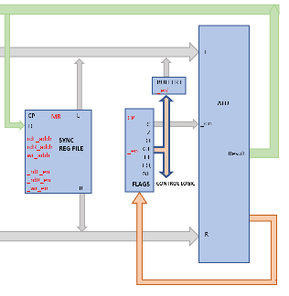

## Addressing modes

### Direct Addressing

The instruction can apply a 16 bit address directly to the RAM so that a given instruction can either read or write and RAM address in each operation. 

### Register Addressing

Alternatively the pair of MARLO and MARHI registers can be loaded with a 16 bit RAM address which for example is useful for indexing into arrays, allowing a read or write at that location.

### Immediate Addressing

The addressing modes also include the ability to apply an 8 but immediate value to the ALU "B" bus on any operation.

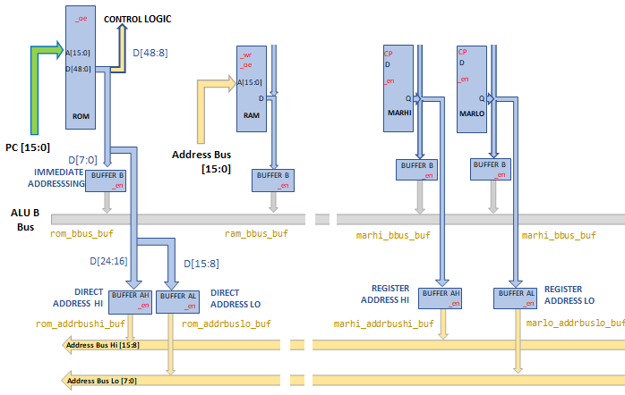

## Instruction Set Architecture

This is not a microcoded arch. See BTW my [thoughts on microcode](docs/thoughts-on-microcode.md).

The earliest design for SPAM1 used Horizonal Microcoding with a distinct control line directly from the program ROM to each device, with no multiplexing or decode logic at all. This design had three 8 bit wide ROM's for the program memory, giving 24 potential individual control lines (or 2x8 control lines plus 8 bits immediate, or 8 bits control and 16 bits immediate depending on what I wanted to achieve). I didn't know the name for such an architecture but I have since found this pattern is known as [Horizontal microcoding](http://wiki.c2.com/?MicroCode)

I felt at the time that using three ROM's for the program memory was excessive and moved to a model whereby I had two ROM's instead. Well that lasted to about 5 minutes.

The final design has an instruction __that is 48 bits wide__. The program is stored in ROM and is 48 bits, organised over six 8 bit ROMs.

Every instruction is of the form `T = A OP B [optional control flag]` . BTW If you are interested in the original design of this instruction set arch then see the [Original Design Branch](https://github.com/Johnlon/spam-1/blob/OriginalDesign/README.md#program-storage).

The instruction encodes the source and target devices, the ALU operation, the addressing mode, the optional immediate value and direct address, plus the condition flags as shown below.

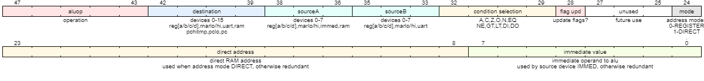

The devices on the ALU input busees A and B, as well as the devices on the ALU result bus are identified using the id's shown below.

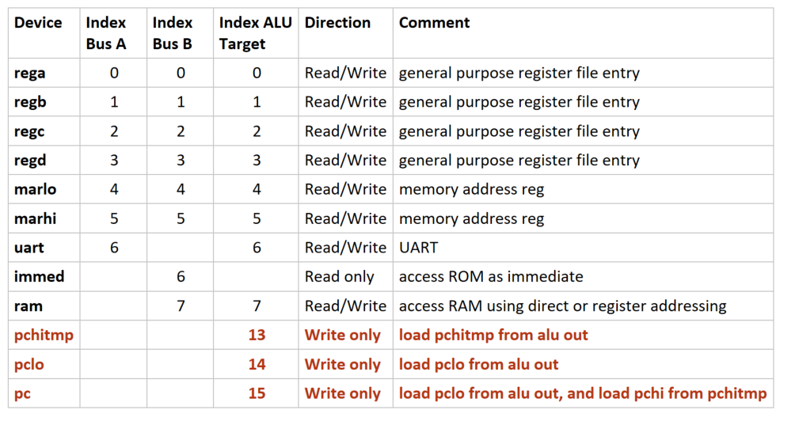

# Hardware Components

Breadboard Layout ...

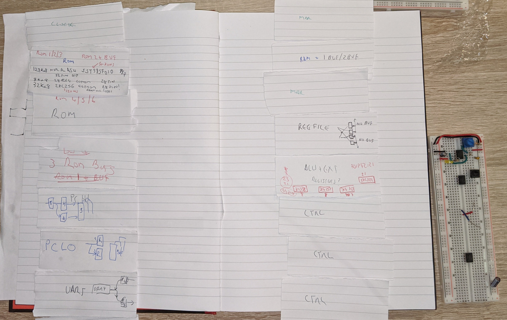

Links to individual pages:

- [CPU timing](docs/cpu_timing.md)
- [Program Counter design](docs/program_counter.md)

  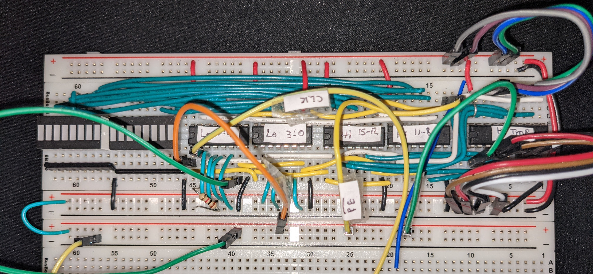

- [ALU Design](docs/alu_with_carry_in.md) 

  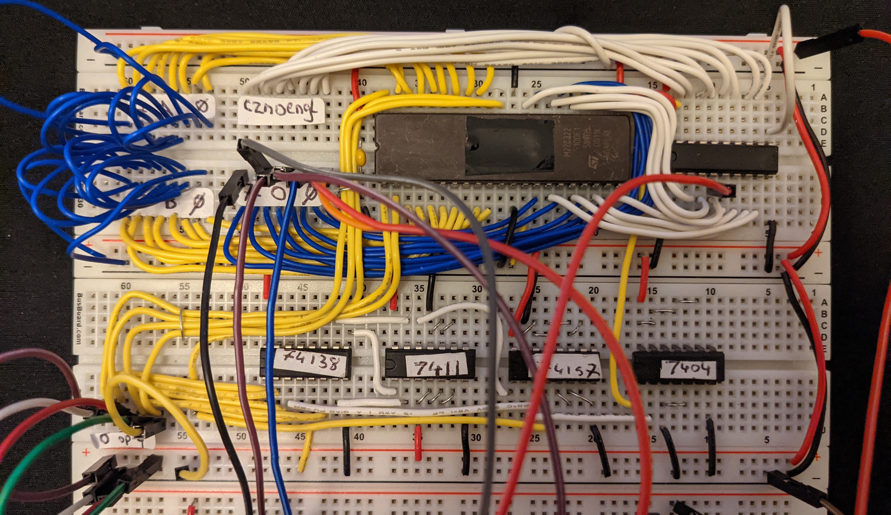

- [Status Register](docs/status_register.md)
- [Register File Design](docs/register_file.md)

  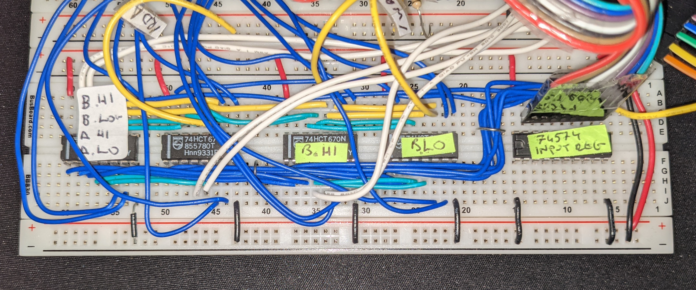

- [UART - UM245R](docs/uart.md)

  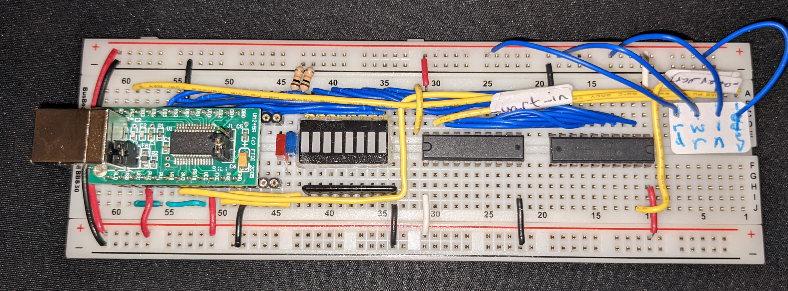

- [MAR - part of RAM Module](docs/memory_address_register.md)
- [RAM - part of RAM Module](docs/ram.md)

  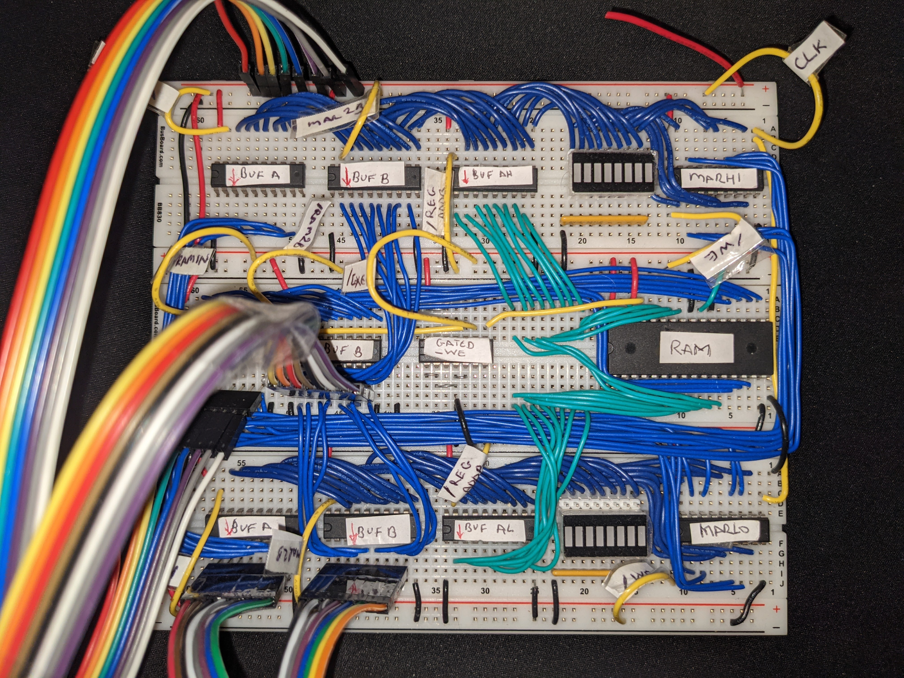


- [Program ROM](docs/program_rom.md)
- [CPU verilog model](verilog/cpu/cpu.v)
- [Control Logic verilog model](verilog/cpu/controller.v)

# Software Components
## Assembler
## SPAM-C compiler
## Simulation
See also my page on [digital simulators](docs/digital-simulators.md)
## Emulation
CHIP-8


# Example Fibonacci Assembly

In the code base there are multiple implementations of Fibonacci. The approach below calls subroutines using registers for argument passing and return address.

```
; Fib using registers for arg passing

ZERO: EQU 0

start:      REGA    = 1
            REGB    = 1
            PCHITMP = >:ZERO  ; take low byte of label 'ZERO' and write to PCHITMP
            REGC    = REGA

            ; set PC to return address and then call the send_uart loop
            REGD    = >:loop
            PC      = >:send_uart

loop:       REGA    = REGA+REGB  _S
            PC      = >:start _C
            REGC    = REGA

            ; set PC to return address and then call the send_uart loop
            REGD    = >:ret1
            PC      = >:send_uart

ret1:       REGB    = REGA+REGB _S
            PC      = >:start _C
            REGC    = REGB

            ; set PC to return address and then call the send_uart loop
            REGD    = >:loop
            PC      = >:send_uart

send_uart:  PC      = >:transmit _DO
            PC      = >:send_uart    ;loop wait

transmit:   UART    = REGC   ; write whatever is in REGC to the UART
            PC      = REGD   ; jump to the location in REGD
end:

END

```

# Documentation Links

The following links take you to documentation covering my research and also design aspects.

 - [Timing Considerations](docs/timing-considerations.md)
 - [Thoughts on Microcode](docs/thoughts-on-microcode.md)
 - [Research and References](docs/references.md)
 - [Hardware Components](docs/components.md)
 - [Digital Simulators](docs/digital-simulators.md)