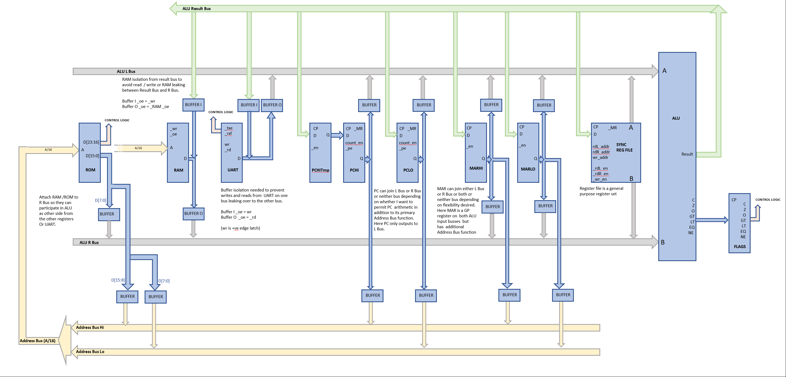

# SPAM-1 CPU - Simple Programmable and Massive

An 8 bit home brew CPU built using 1970's logic chips.

This project is currently in it's 3rd incarnation. 

## Version 1a

You can see the first incarnation here on the [OriginalDesign branch](https://github.com/Johnlon/spam-1/tree/OriginalDesign)

This version had a very simple arch that was easily implementable and for which I wrote a logisim simulation and also an assember in GoogleSheets that could be used to program the sim.
:thumbsup: See the [SPAM-1 Assembler](https://docs.google.com/spreadsheets/d/1lYyPqYNF1dGDRP2n3ablaqkgZuxJ9x6T-ylut_nT1p4/edit?usp=sharing) implemented in Google Sheets.  

However, once I got that far I decided it was rather too simple and limited for me to build. I wanted more of a challenge.
It's now months later and the challence is still brewing, which is a bit of a disappointment.

## Verson 1b

This was a pretty massive increase in complexity and capability however, while this was definitely more of a challenge I felt the trade off between added compexity and added capability wasn't favourable, so I decided what was needed was a little bit more technical complexity for a lot more capability.

## Version 1c 

I'm currently working on what I hope is the final version.

This has a 48 bit instruction word spread across 6 ROM's. It's 48 bit instruction read as a single operation as I couldn't be bothered with the instruction register logic necessary
 to drive the CPU off a single big ROM (plus it's faster that way). The other big change is that I've included a bunch of features that are intended for exploration and
  learning such as a register file and having 5 buses!


# Documentation Links

See also:
 - [ALU Design](docs/alu_with_carry_in.md)
 - [Timing Considerations](docs/timing-considerations.md)
 - [Thoughts on Microcode](docs/thoughts-on-microcode.md)
 - [Research and References](docs/references.md)
 - [Hardware Components](docs/components.md)
 - [Digital Simulators](docs/digital-simulators.md)

# Motivation

A bit of fun!

I started working life in 1986 as a hardware engineer but quickly switched to software. As a teenager I'd been fascinated with
discrete electronics and then later on with integrated circuits and build many little home projects; nothing too exciting as we didn't have the resources (ie ££) back then.

Recently, like many other folk, I came across [Ben Eater's series of YT videos](https://www.youtube.com/watch?v=HyznrdDSSGM&list=PLowKtXNTBypGqImE405J2565dvjafglHU) and also those of quite a few others that inspired me to have a go at building my
own CPU. Back in 1980 even the relatively few parts needed would probably have been beyond my means, but not anymore !!

However, back in the 1980's I would have been building more or less blind. I still don't have an oscilloscope but what I do have is a simulator.   

Having spent a few weeks getting to know [Logisim Evolution](https://github.com/reds-heig/logisim-evolution)  and having hours trying to figure out the fine details of my simulated processor
it's clear that if I had attempted to build a CPU back in 1980 then I'd have fallen flat on my face.
It's been a great learning experience, if frustrating at times.

So I've decided to build an 8 bit CPU for myself, for the sheer joy and nostalgia, sweat and tears.

Since then I've extended the design extensively and have chosen to simulate the whole thing in Verilog with accurate propagation delays to hopefully tease out timing errors (I don't own an oscilloscope!).

Leaning verilog and reworking most of the design has taken months, but as of Jun 2020, I'm on the verge fo finalising the verilog and will have a go at writing various programs to prove out the design and test it's capabilities.

# Objectives

- :green_square::white_large_square::white_large_square: I want to build something non-trivial with direct and immediate addressing capabilities for variety
- :green_square::white_large_square::white_large_square: I want to use it as a vehicle for learning about lots of stuff including register files and other curiosities plus instruction set design, some lesser known chips, and so on
- [x] I originally wanted to be able to run at least the typical demo programs like Fibonacci, but that proved pretty trivial and was done in version 1a as a program on the Logisim version
- [x] I want to be able to run some games somehow - hardware without software is nothing (update: 2021 - I have the verilog hardware simulator running a Chip 8 emulator)
- [x] I will write an assembly language and assembler 
- [x] I will create some kind of higher level language compiler
- [x] I want to simulate the hardware entirely first, using verilog
- [ ] I want to build it physically, or a more likely a derivative (update 2020: it has turned out to be a distant derivative of the original design)
- [ ] I want to attach some output devices - eg a UART / tty that respects VT codes
- [ ] I want to hook it up to a basic graphics output using VGA - stretch
- [ ] I would like to extend it to play some kind of basic game (update 2021: I've got the simulator running a Chip8 emulator over the simulated UART onto a terminal)
- [ ] I want to finally complete it during 2020 (please!!!  update 2021 : failed on this big time!)

:star: Initially I wanted to do the tool chain a little differently to some of the other efforts on the internet! I want the assembler and any other code I write to to be more readily accessible and instantly usable to others without installing python or perl or whatever first, so I've wrote an assembler in google sheets! 

However, further development of the design really required more powerful tooling such as Icarus Verilog as well as Python after all.

My development environment is still pretty accessible as I use Windows 10 running the Windows Subsystem for Linux. So I have a full Linux environment without the need to install a virtualisation software like VirtualBox and it all just works very sweet. The integration between Windows 10 and WSL is brilliant and I use the same environment for any opensource coding I do these days. I wish I could use it at work frankly.

I will at some point do a video on setting up the tooling as it's generally useful I feel and shouldn't put folk off trying this kind of thing themselves. I use VSCode for the verilog and documentation. I use IntelliJ profressionally but the verilog plugins for intelliJ as commercial only so no thanks to that. I'll include the VSCode setup in whatever video I do and I'll probably write it up here and/or in the [Hackaday project](https://hackaday.io/project/166922-spam-1-8-bit-cpu).

# Architecture Summary

- Five ~~Single~~ bus
- 8 bits data
- 16 ~~8~~ bits address
- 24 ~~16~~ bit instruction
- 8 bit ALU - full complement of arithmentic and logical ops (approx 32) and magnitude comparisons
- Separate RAM and ROM (for no particular reason - could have been all RAM or a single address space)
- Fetch/Decode/Execute. Was originally Fetch/Decode on one edge of clock and Execute on the other but this was limiting in terms of being able to implement a direct addressing mode. I might still build it as a single cycle machine and then add in direct addressing incrementally. Direct addressing also requires me to introduct a 24 bit instruction register.
- The original design was to use horizontal microcode style instructions, not "microcoded" instructions, ie each instruction is at microcode level and directly enables the necessary control lines.
Therefore control logic would be trivial. However, as the number of devices in the design increased this approach became less feasible. The design now uses a four bit addressing scheme encoded into the instruictons to select the devices that will participate in the operation. I would dearly liek to go back to a simple horizontal encoding approach and mighe at some point rip up my control logic and base the design on 6 or 10 program roms so that I can directly drive all the control lines with almost no additional logic. I quite like the idea that it would be rather like a hand cranked music box. 

   

- Registers
  - Register file : registers A/B/C/D
  - Memory Address Register : MARHI and MARLO
  - Program Counter (PC)
  - Status (flags) register - Zero,  Carry, Equals, Overflow plus comparator flags
  - UART for output and input

- Instruction set is phrased around moving data from device to device and all transfers go via the ALU.


# Progress

## v1c

In the final design I decided to push everything via the ALU.

The design is shown towards the top of this page.

The initial sketch was this ....




## v1b

This version was a verilog and paper design. But as mentioned earlier it wasn't enough of an functional improvement so I let this continuie to evolve.

I had started thinking about how to pass ROM or RAM output via the ALU as well as the registers, but I still had a data bus.


Prior to that I extended the address space to 16 bits and started thinking about other approaches to memory addressing.


## v1a

The first incarnation.


I spent a couple of weeks building the sim for a CPU. It was 8 bit and based on ideas from various places but kind of grew by itself with a little planning. It's was fairly primitive one in that there is no microcoding of higher level instructions, or to put it another way every instruction is microcode. 
It turned out that this approach means SPAM1 doesn't need an instruction register. This might change if I modify the design to include variable length instructions.

:star: The complete set of instruction and argument combinations were [here](docs/instructions.txt)

- The simulator worked
- The assembler and decoder worked (see below) and I'm was happy with the way the software turned out
- My Fib program counted up and down in a loop

So all good !!

This is currently simulated in Logism (see more below).


## :thumbsup: I've built an assembly language for it and also an assembler.

I've built the assembler in Google Sheets, which I think might be a pretty unique approach (let me know).

 


# Architecture


####### FIXME THIS DOCUMENTATION NEEDS UPDATING FOR 24 and 42 bit - KEEP REFERENCES TO THE OLDER BRANCHES OF THE CODE.

## CPU Phases

The CPU has three'ish phases,  _fetch_, _decode_ and an _execute_. However, this CPU does not have an instruction register so the fetch and decode phases aren't really distinct as there is no latching involved and the whole sequence occurs within a single clock cycle as illustrated below.


The first phase is to load the PC with the instruction address so that the program bytes made available to the decode logic. The PC is set on the rising edge of the clock. Because there is no instruction register this is the closest we get to a conventional "fetch". 

The second phase, decoding the program bytes into control lines, occurs during the high level of the clock. These control lines are fed to the various components of the CPU and determine what happens to those components during the execute phase.

The third phase, execute, occurs on the falling edge of the clock and this is where registers latch their value from the data bus.

Except ... that's not honestly how it works.

It's really more like the illustration below in my mind; when reading the diagram imagine that this diagram starts immediatly following a CPU reset or power on.


When the CPU is reset then the clock is low, PC is already at address 0 and the control lines are settling. This is phase 1).

Phase 2) is at the rising edge of the clock where the instruction is executed.

Phase 3) is at the falling edge of the clock where the instruction counter is advanced and the cycle begins again at the new address.  

(BTW - note that I say in the diagram that nothing much happens on the high or low levels, but a hugely significant thing that happens on the levels is [settling of the combinatorial logic](docs/timing-considerations.md) which must be respected if the CPU is to be stable.)

A significant consequence of this setup is that the PC is not advanced until after the complete execution of the instruction. This is significant because it means that if we were to stash the PC onto the stack at this point, in order to make a call to a subroutine, then on return from the subroutine we would end up loading the PC with the same address that it hard before the jump. This might put the CPU into an endless loop.

This might be solved by incrementing the PC before pushing to the stack or after popping from the stack. But I mention it because this is different to many other CPU's. For example [the instruction cycle described by Oxford University](https://www.robots.ox.ac.uk/~dwm/Courses/2CO_2014/2CO-N2.pdf) states that _"The last part of the fetch is to increment the PC"_. 

But, if we increment the PC before executing the instruction then we definitely need to introduce an Instruction Register to hold the control lines stable while the PC is advanced to the next instruction. 

I considered this and it occurred to me that except in a few edge cases the assembler ought to be able to statically calculate the correct return address for a call and so in practice we would never push the PC to the stack but instead we would push a constant calculated at compile time by the assembler.

I'm still undecided on this - but moving to an 8 bit instruction will almost certainly require the introduction of instruction registers to latch the multiple 8 bit components of the instruction.      

See also my research on [timing considerations](docs/timing-considerations.md).
 

## Instruction Set Architecture

The earliest design for SPAM1 used Horizonal Microcoding with a separate control line for each  device with no multiplexing. This design had three 8 bit wide ROM's for the program memory, giving 24 potential individual control lines (or 2x8 control lines plus 8 bits immediate, or 8 bits control and 16 bits immediate depending on what I wanted to achieve).

At the time I didn't know the name for an architecture where each device had its own control line and any arbitrary selection of devices could be enabled simultaneously, but I have since found this pattern is known as [Horizontal microcoding](http://wiki.c2.com/?MicroCode)

I felt that using three ROM's for the program memory was excessive and moved to a movel whereby I had two ROM's and that's what I discuss in the next section.

 See also my [thoughts on microcode](docs/thoughts-on-microcode.md).

## Program Storage

Program is stored in ROM and is a fixed width 16 bit instruction, organised over a pair of 8 bit ROMs, one each for the high and low bytes of the instruction.

The high byte defines the operation and the low byte is used only for immediate constants (at present) which means this low ROM it often unused and is wasteful.
 
### High ROM byte

The high order bytes is organised into three parts, identifying the ALU operation and the input and output devices.


- 2 "ALU" bits configure the ALU operation - only add/subtract right now.
- 3 "OUT" bits select one device (0-7) that will be enabled to output onto the bus.
- 3 "IN" bits select the device who's input register will be enabled to latch the value on the bus.
  
Therefore with this design I can have at most 8 "input" devices and 8 "output" devices (some ideas on improving this are below). Also, a maximum of 4 ALU operations are possible.

### Low ROM byte

This low order ROM is used only for program constants at present; this is rather wasteful (see below). 

### Example Program - Fibonacci

```
:start	    LD A,#0
            DISP A
            LD B, #1
            DISP B

:loopUp     ADD A
            BCS :backDown
            DISP A
            ADD A
            BCS :backDown
            DISP B
            JMP :loopUp
	
:backDown   LD A,#e9
            LD B,#90
            LD MAR, #0
            DISP B
:loopDown   SUB A
            BZS :start
            DISP A
            LD RAM, A
            LD A, B
            LD B, RAM
            JMP :loopDown                              
```

## Review of this Instruction Architecture

There are a few problems with this design.

The most serious IMHO is that we are limited to 4 ALU operatons; these are currently ADD/SUB/ADC/SBC, the latter two being add and subtract but taking a previous carry into account. 

Add and subtrace are sufficient to run Fibonacci but to do anything more interesting this CPU will need a much wider range of ALU operations; more likely 16 or 32. 

To achieve this extra control there are really only a few options.

- Use the lower ROM more effectively by using the low byte as an extention of op code, when it's not being used for immediate data. In this case the lower ROM could carry extended ALU control lines.
- Expand the program ROM to 24 bits width by using three 8 bit ROMS instead of the current 2. This approach is even more wasteful. But it's definitely simple. 
- Change the design to use variable length instructions to achieve the extra control, eg making the op code 2 consecutive bytes followed optionally by a third immediate byte or word.

However, an addition shortcomings of the current design is that I cannot run a program from RAM even if I wanted to. If I want to be able to run a program from RAM then I would need RAM and ROM to be more symetrical. I would need my ROM and RAM to have the same number of bits. I would probably choose 8 bits to keep the hardware complexity down. 

Of course I could do away with the program ROM entirely (Ben didn't have one) but I want the option of permanently storing the program.

So I guess the best option is to rework the design to be more Von Neumann and unify the RAM and ROM components somehow to 8 bits with and both addressable by the PC. 


## Program Counter

The original program counter Logism simulation was based on a register and an adder. 


This approach seemed to work ok, especially in Logism, when I was thinking of just 4 bits, but with 8 bits we end up with more complexity than I was happy with.

I've since switched to a more scalable design using a presetable counter.


One small but important detail of the new design is the inclusion of an SR latch. With the original register+added  approach the reset to address 0x0 was asynchronous, but with the counter in Logism the counter reset is synchronous. Logism's counter has a synchronous reset similar to the [74HCT163](https://www.ti.com/lit/ds/symlink/cd54hc163.pdf), whereas the [74HCT161](https://www.ti.com/lit/ds/symlink/cd54hc163.pdf) allows an asynchronous reset. 

In order for the reset to be reliably transmitted to the PC in Logism (or 74163) we need to latch the reset signal until the clock gets a chance to hit the counter. We use the same clock to reset the latch.

See also the [timing considerations](docs/timing-considerations.md) page where I refer to "newbie" advice that encourages the sort of synchronisation I fould was needed.

    
# Improvements

This current design is inadequate and not yet ready for a hardware build. I've already disussed some necessary improvements above but more are discussed below...

## Better use of ROM

My use of a fixed 16 bit instruction word is quite wasteful. Unless I'm dealing with a constant then the second ROM is entirely unused.

One solution is a variable width 8 bit instruction where most instructions are 8 bit, but when ROM_out is enabled in the first byte then the control logic looks for the operand in the subsequent byte.

If I do this then I'm going to need to introduce one or more 8 bit latch chips forming an Instruction register component. 

## Immediate arithmetic

At present I can only interact with the ALU via the A/B registers. This means I can't do arithmetic
 on a value from the ROM or RAM without wiping one of those two registers. I can of course mux the data bus into the
 ALU, however, a problem with getting a value from RAM into the ALU 
  and capturing the result of the arithmetic is that I only have one bus and I can't have both the RAM active out on the BUS
 whilst also having the ALU active out. A solution might be to put a register on the output of the ALU so that I can do the arithmetic in
 one micro-instruction and then emit the result in the next micro-instruction. 
 
## CALL and RET

I'd like to demonstrate a call to a subroutine and a return from that call. 

All my instructions are micro-instructions and doing a "CALL" requires at least two micro-instructions, one to push the PC into RAM then another to move the PC to 
the new location. So I don't think I have the luxury of being able to introduce an "CALL" op code in the hardware. However the assembler could certainly expand a 
"CALL :label" into something like this (note: typically one places a stack at the end of memory and works backwards through RAM as items are pushed to the stack- I've used that approach below). Notice that both A and B registers get trashed in the Call and Ret so can't be used for passing arguments to the subroutine. Having an auto-incrementing SP (more like PC) and auto-decrementing SP would save a bunch of instructions and also avoid trashing the two registers.

What call convention do I want???? Stack or Register?
In this design there isn't a SP register just a defined location in RAM.
 

```
#### CALL
#Assembler has to work out where the call will return to, i th address directly after the call code below, and '<PC RETPOINT>' signifies that address.

# store "PC RETPOINT" into the stack
    MAR=#SP_LOCATION   #set the MAR to point at the location of the SP
    MAR=RAM            #move the MAR to point at the value of the SP - ie into the stack
    RAM=<PC RETPOINT>  # stash the return location onto the stack

# advance the stack pointer 
    MAR=#SP_LOCATION
    A=RAM              #a=the value of the SP
    B=1
    ADD A              #a now SP+1
    RAM=A              #SP now incremented

# Jump to subroutine
    PC=#SP_LOCATION

#### RET

# decrement stack pointer
    MAR=#SP_LOCATION
    A=RAM              #a=SP
    B=1
    SUB A
    RAM=A              #SP now decremented

# Return from subroutine
    MAR=#SP_LOCATION
    MAR=RAM            #move MAR to point at the value of the SP - ie into the stack
    PC=RAM             # execution continues at new PC
    
```

And "RET" could be expanded to.  


```
# increment stack pointer
    A=RAM[#stackpointer_location]
    B=1
    ADD A
    RAM[#stackpointer_location]=A

# retrieve stack pointer into the PC
    MAR=RAM[#stackpointer_location]     #set the MAR to point at the current location of the SP
    PC=RAM
```

If passing args to the subroutine then they would also need to go into RAM and I could add a "PUSH" instruction to the Assembler to support this.

Where other processors have high level instruction built into the hardware and the control logic decodes this into micro-instructions,
 in my case the high level instructions would be merely a feature of the assembler and the assembler would "compile" these into the 
 micro-instructions that my CPU uses.
 
On a more traditional CPU a binary program (eg ".exe" or ELF executable) could work on multiple CPU types with different underlying CPU hardware and micro-instructions
as long as the CPU's all support the same set of "high level" Opcodes. The CPU's control logic takes care of translating the high level opcodes into the internal 
 micro-instruction language of the CPU. However, in my case that translation is happening in the assembler and if there is a change to the hardware
 then this renders all programs inoperable; there is no abstraction to save me.
 Of course I can just recompile the assembler to resolve the issue, however, this goes to highlight the power of high level op codes and embedded micro-code where no 
 recompilation is necessary (eg Intel vs AMD).  

Using the assembler to compile high level opcodes I can add things like ..

```
CALL :subroutine
RET 
PUSH <some register>
POP <some register>
INC <come register>
DEC <come register>
```           

## Save a control line 

?Memory map the Display device?

The display register steals a control line. In principal this could just be mapped to a specific memory location which would free up the control line
for something useful, for instance doubling the number if Input or Output devices on the bus. This might for instance allow me to implement Branch on Equals.
Though to be fair I have two selector lines going into the ALU and use only one of them at present so I could co-opt that if I wanted.

## Add more ALU operations

- Add logical operations.
- Add a shift left/right to the ALU (same as multiply by 2, div by 2)
- Add BCD operations

This is a biggie.

See also the ongoing [design of the ALU](docs/alu_with_carry_in.md).

Having no logical operations at all is far from ideal.

But this would mean feeding at least three selector lines into it, which could give me 8 potential operations rather than the two I have currently implemented. 
However, I am already short on control lines so this isn't too appealing. If I switched to variable length instructions or added a register to 
the output of the ALU then perhaps I could get a lot more flexibility. Dunno.

Alternatively I could do something like add an 8 bit register for the ALU config, eg giving me 256 possible ALU operations. Or I could organise the 8 bit register 
 as 4 bits for multiplexing the inputs and output of the ALU, and 4 bits for the selection of the ALU operation. If I multiplex the inputs and outputs 
 of the ALU then I could do something like having a 4x8bit register file rather than just A and B and I could multiplex the RAM or ROM or whatever into the 
ALU overcoming the register trashing  problem mentioned earlier.

Or perhaps the variable length instruction idea could yield benefits by giving me another 8 bits for control logic.

Obviously, being able to simulate all this before building is fantastic.

I am considering basing the future ALU on a similar set to that used by [CrazySmallCpu](https://minnie.tuhs.org/Programs/CrazySmallCPU/description.html) ...

```
Currently the ALU can perform sixteen operations based on the A and B inputs:
A + B decimal
A - B decimal
A & B
A | B
A ^ B
A + 1
Output 0, flags set to B's value
Output 0
A + B binary
A - B binary
Output A
Output B
A * B binary, high nibble
A * B binary, low nibble
A / B binary
A % B binary
```

Might use a ROM for the ALU. But haven't figured out with a single 8 bit wide ROM how to get a carry bit which would be necessary for chaining arithmetic to achieve arbitrary length additions. 
Perhaps this will require two 8 bit ROMS operating in 4 bit chained mode, or perhaps revert to using 4 bit arithmetic and chain operations in software? Not sure.

On the other hand I have two reclaimed [74181](http://ee-classes.usc.edu/ee459/library/datasheets/DM74LS181.pdf) ALU's in my desk - I think I should use those for nostalgia reasons.
I don't get BCD arithmetic with the 74181 but I do get to use the same type of chip that went went to the moon. Hooking it up fully would take 5 control lines plus the carry in. 
Hmm, I don't think I have the "LS" version which only pulls 20-40mA. The SN74181N that I have pulls a horrible amount of current according to the datasheet; 88-150mA.

  
## Write a C compiler

Yep - a C compile - others have done it.

Hmm. 
- Or perhaps [PL/0](https://www.youtube.com/watch?v=hF43WUd8jrg&list=PLgAD2y-6wgwoTnPfZWhMuXID14xnzkz2x)??

- https://github.com/DoctorWkt/smallc
- http://www.cpm.z80.de/small_c.html


# Simulation

See also my page on [digital simulators](docs/digital-simulators.md)

## Run the simulator

Works in Window 10 at least. I haven't tried running Logism yet on Linux but it's all Java. 

- Clone the git repository
- Change directory to _./logism_ subdirectory
- Run the logism evolution jar in the repo's _logism/_ subdirectory (or download the latest version from [the author's git repo](https://github.com/reds-heig/logisim-evolution)) 
- Load the circuit from the same directory
- Start the simulator. Menu -> Simulator -> Ticks Enabled

## Change the Assembly Program

- Open the [SPAM1 CPU Assembler](https://docs.google.com/spreadsheets/d/1lYyPqYNF1dGDRP2n3ablaqkgZuxJ9x6T-ylut_nT1p4/edit?usp=sharing) implemented in Google Sheets

- Goto, or duplicate, the "Fibonacci Assembler Demo" tab 
- Make some changes to the Assembler
- Copy the ROM bytes from the pink cells on the right of that same page into your clipboard
- Place the data into the files on disk and then load into the ROMS or paste direct into the ROM's in Logism
    - Unfortunately the clipboard will have quotes in it so edit the clipboard in a test editor to remove the two quote.
    - If you are not writing the clipboard into a "rom file" the remove the "v2.0 header" from the clipboard contents too
 - Start the Logism simulator as above

## Instruction Decoding

There is also an "instruction decoder" page in google sheets which will decode an assembly program and show you which control lines are enabled for each instruction in the program.


