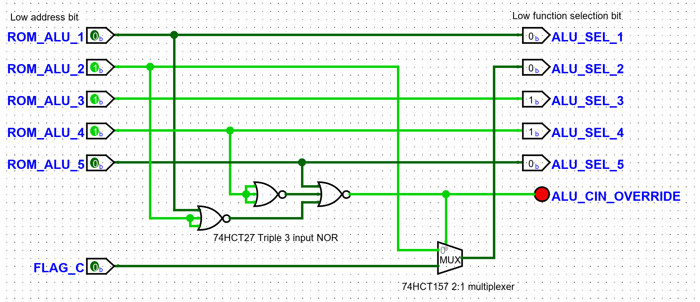

# ALU Design 

This ALU design is based on [Warren Toomey's CSCvon8 ALU](https://github.com/DoctorWkt/CSCvon8/blob/master/Docs/CSCvon8_design.md) but with a few small changes to incorporate a carry-in for a few of the ops. CSCvon8n does this switch in software/microcode. 

Like CSCvon8 the design relies on the [M27C322 2Mx16 EPROM](http://pdf.datasheetcatalog.com/datasheet/stmicroelectronics/6184.pdf). This 2M x 16bit device is great for an 8 bit ALU as it allows 21 bits of addressing which is enough for 2 lots of 8 bits data-in, plus 5 bits for ALU function selection. The 16 bits out allows for a full 8 bit result, with the remaining 8 bits of data output providing a full complement of status flags. More details can be found in the [CSCvon8 documentation](https://github.com/DoctorWkt/CSCvon8/blob/master/Docs/CSCvon8_design.md) 

Inputs
----

- 8 bit : A
- 8 bit : B
- 5 bit : Operation selection - see carry logic below

Flags and Jumps
----

ALU operation result flags:
- D : div by zero
- N : negative result 
- Z : zero result
- V : signed overflow
- C : carry

CSCvon8 synthesises comparator results EQ/NE/GT/LT/LE/GE by selecting appropriate an ALU operation and selecting particular output flags, and using these flag for the jumps. For example with the operation _A-B_ then the _C_ out flag set can be used to trigger a jump for _A<B_ 

With 3 remaining output bits from the ROM one could possibly also provide  comparator outputs for each combination of inputs:
- GT : A > B
- LT : A < B
which could be externally combined to produce
- EQ : /GT AND /LT

or just two :
- GE : A >= B
- LE : A <= B
which could be externally combined to produce
- EQ = GE AND LE

Leaving 1 bit for something.

ALU Functions
----

The SPAM-1 ALU ROM functions are ...

| 0-7 ALU Ops | 8-15 ALU Ops      | 16-23 ALU Ops     | 24-31 ALU Ops |
|-------------|-------------------|-------------------|---------------|
| 0           | B-1               | A*B (high bits)   | A ROR B       |
| A           | __A+B+Cin (0)__   | A*B (low bits)    | A AND B       |
| B           | __A-B-Cin (0)__   | A/B               | A OR B        |
| -A          | __B-A-Cin (0)__   | A%B               | A XOR B       |
| -B          | A-B (special)     | A << B            | NOT A         |
| A+1         | __A+B+Cin (1)__   | A >> B arithmetic | NOT B         |
| B+1         | __A-B-Cin (1)__   | A >> B logical    | A+B (BCD)     |
| A-1         | __B-A-Cin (1)__   | A ROL B           | A-B (BCD)     |

Re "A-B (special)" above, see [CSCVon8 ALU design](https://github.com/DoctorWkt/CSCvon8/blob/2b362a9e793238ebd150855a6dd6c5987674c7c6/Docs/CSCvon8_design.md) for an explanation of "Special"

Where this ALU differs to CSCvon8 is that I wanted the SPAM-1 arithmetic for A and B to take the carry bit into account in the hardware. So in column 2 where I have 3 such operations at 9/10/11 and at 13/14/15.

For these 6 addition/subtraction functions the value of the second address line into the ROM will be derived from the carry bit rather from the raw bit 2 coming from the control logic. To achieve this there will be an additional bit of multplexing logic external to the ROM. (If we could find a 4Mx8 DIP EPROM, with an additional address line then this external logic could have been avoided). In any case the additional logic selected either the carry-flag or the original address line and looks like this ...

With this setup then when accessing operations 9/10/11 then they will be promoted to the "+/-1" variants 13/14/15 respectively when carry is set.

# Links

Tools I found useful working things out:

- [Logic simplification](http://www.32x8.com/index.html) helped me work out [the external logic](http://www.32x8.com/sop5_____A-B-C-D-E_____m_9-10-11-13-14-15___________option-0_____889788875878823595647)

- [Boolean Expressions Calculator](https://www.dcode.fr/boolean-expressions-calculator) for converting the simplified external logic into a NOR-only representation for the hardware build.
