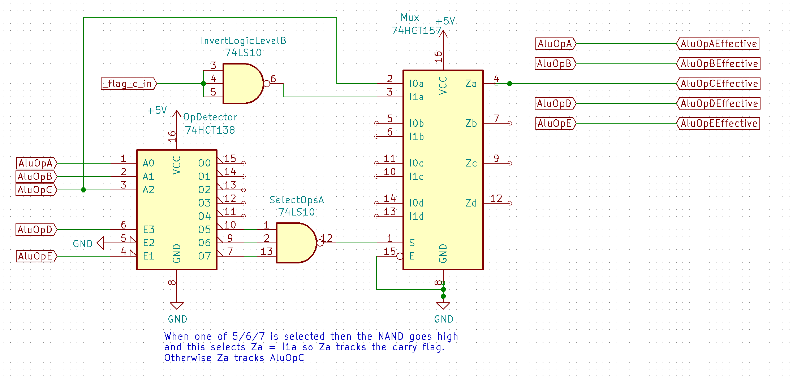

# ALU Design 

This ALU design is based on [Warren Toomey's CSCvon8 ALU](https://github.com/DoctorWkt/CSCvon8/blob/master/Docs/CSCvon8_design.md) but with a few small changes to incorporate a carry-in for a few of the ops. CSCvon8n does this switch in software/microcode. 

Like CSCvon8 the design relies on the [M27C322 2Mx16 EPROM](http://pdf.datasheetcatalog.com/datasheet/stmicroelectronics/6184.pdf). This 2M x 16bit device is great for an 8 bit ALU as it allows 21 bits of addressing which is enough for 2 lots of 8 bits data-in, plus 5 bits for ALU function selection. The 16 bits out allows for a full 8 bit result, with the remaining 8 bits of data output providing a full complement of status flags. More details can be found in the [CSCvon8 documentation](https://github.com/DoctorWkt/CSCvon8/blob/master/Docs/CSCvon8_design.md) 

Inputs
----

- 8 bit : A
- 8 bit : B
- 5 bit : Operation selection 
- carry-in : see below for this feature

The 5 bit operation selection and the carry-in bit are multiplexed together as described further below.

Flags and Jumps
----

This ALU implementation differs from that of CSCVon8 in it's flag outputs.

ALU operation result flags will be:
- N : negative result (top bit is set - two's complement)
- Z : zero result
- V : signed overflow / also set when div by zero
- C : carry

Additionally the following magnitude comparator flags will be provided from the ROM:
- GT : A > B 
- LT : A < B
- EQ : A = B
- NE : A != B

ALU Functions
----

The SPAM-1 ALU ROM functions are ...

| 0-7 ALU Ops | 8-15 ALU Ops            | 16-23 ALU Ops     | 24-31 ALU Ops |
|-------------|-------------------------|-------------------|---------------|
| 0           | B-1                     | A\*B (high bits)  | A RRC B       |
| A           | __A+B__\*1   | A\*B (low bits)   | A AND B       |
| B           | __A-B__\*1   | A/B               | A OR B        |
| -A          | __B-A__\*1   | A%B               | A XOR B       |
| -B          | A-B (special)           | A << B            | A NAND B      |
| BA / 10     | __A+B+1__\*2 | A >> B arithmetic | NOT B         |
| BA % 10     | __A-B-1__\*2 | A >> B logical    | A+B (BCD)     |
| B+1         | __B-A-1__\*2 | A RLC B           | A-B (BCD)     |

*1 these ops will be used if the instruction directly selects ops 9/10/11, or, when the instruction selects 13/14/15 but carry-in is not set 
*2 these ops are selected when the instruction is selecting ops 13/14/15 and carry-in is set; if carry-in is not set then see *1 
See notes below for further info.

This ALU differs in a few additional respects to CSCvon8
- carry-in 
- magnitude comparisons
- no A+/-1 operations
- additional BCD operations replace A+/-1
- A NAND B replaces NOT A
- ROL and ROR renamed to RLC and RRC

**This ALU uses carryin**:

I wanted the SPAM-1 ALU to take carry-in into account, however there are only 5 address bits left on the ROM for alu operation selection.
If I wanted to dedicate an address bit solely as carry-in then that would mean I'd be able to support only 16 distinct operations on the ALU, and also 
 that carry-in bit would be meaningless on many of the operations, particularly the logical operations. (Arguably, the logical shift operations might accept a carry-in but I've not considered that.)

So, the alternative approach I've come up with is to multiplex the carry-in into the ALU operation selection logic by the addition of some external circuitry. 

This external circuitry only has an active affect when one of the ALU ops 13/14/15 is selected. When one of these three ops is selected then the external circuitry multiplexes the CarryIn flag in replacing bit 2 of the address. As a result when the selected operation is 13/14/15 and CarryIn is NOT set then the ALU operation is modified with bit2=0 resulting in operations 9/10/11 respectively actually being used. This logic has no impact when operations 9/10/11 are directly selected.

The result of this is that 9/10/11 are addition and subtraction *without* carry-in taken into account, whereas 13/14/15 are arithmetic *with* carry in taken into account.
Using this approach I get my carry-in logic and at the same time I can directly select ops 9/10/11 when I don't want carry-in considered. This second benefit means I don't need to come up with a "clear carry" operation because I can simply select 9/10/11 directly when carry-in is not desired.

**Magnitude comparisons:**

The "A-B (special)" operation is shared with CSCVon8 but has a different function in SPAM-1. 

In CSCVon8 the "A-B (special)" operation has this description: *"The special "A - B" ALU operation still produces the result of A - B, but the Zero flag is inverted to allow the not equals comparison.*
See [CSCVon8 ALU design](https://github.com/DoctorWkt/CSCvon8/blob/2b362a9e793238ebd150855a6dd6c5987674c7c6/Docs/CSCvon8_design.md). 

However, I am planning to use this operation differently.

SPAM-1's arithmetic operations support two's complement inputs and output, ie signed arithemetic. Howewer, the magnitude comparator outputs LT/GT compare the two 8 bit input values in terms of logical magnitude; ie unsigned.
So inI decided to repurpose this "special" operation so that when it's used then the ALU does a twos complement signed magnitude comparison of the two input values instead of unsigned. 

:grey_question: For interest see how the 74AS885 permits selection of "logical" or "arithmetic" magnitude comparison in the [74AS885 datasheet](https://www.ti.com/lit/ds/symlink/sn74as885.pdf?ts=1592517566383&ref_url=https%253A%252F%252Fwww.google.com%252F) as this is the same idea. 

**Demise of A+1 / A-1**

SPAM-1 doesn't need a dedicated increment A/decrement A operation because the same can be achieve using A+B or A-B with B as the immediate value '1'. So those two operations were deleted and two new BCD operations added instead. 

**Additional BCD Operations**

A+1 and A-1 of the original CscVon8 ALU have been replaced with a couple of BCD operations borrowed from David Cliffords fork of CSCVon8 https://github.com/davidclifford/CSCvon8/blob/master/gen_alu , these ops provide a /10 and %10 operation using A as the 1's and 10's value to divide, and B is holding the 100's 'remainder' value. The idea is that B holds the remainder with a value between 0 and 9 of a previous higher order division.

**A NAND B**

A dedicated NOT A is not needed in SPAM because the same can be achieved with A XOR B where B hold the immediate value 0xFF. So NOT A was replaced with the slightly more useful A NAND B.

**ROR/ROL become RLC/RRC**

The Z80 names RLC/RRC better relate to the operation being performed by these operations so I've renamed them accordingly.

Further note vs CscVon8
----

CSCvon8 synthesises comparator results EQ/NE/GT/LT/LE/GE by selecting an appropriate an ALU operation and selecting particular output flags, and then using these flag for the jumps. For example with the operation _A-B_ then the _C_ out flag set can be used to trigger a jump for _A<B_ 

The 7 bit output value plus the 8 output flags use up the 16 bits of space on the ALU ROM. However, if necessary then there is a ways to claw back two of these bits and still retain the same comparator function.

If we were to support just: 
- GT : A > B
- LT : A < B
then some logic external to the ALU ROM can easily synthesise:
- NE : GT OR LT
- EQ : /NE

Or alternatively this approach... 
- GE : A >= B
- LE : A <= B
which could be externally combined to produce
- EQ = GE AND LE
- NE = /EQ

... leaving 1 ALU ROM bit for something else.

However I don't need these lines to be spare so I will use distinct Eq/Ne/Gt/Lt lines to reduce component counts.

# Links

Tools I found useful working things out:

- [Logic simplification](http://www.32x8.com/index.html) helped me work out [the external logic](http://www.32x8.com/sop5_____A-B-C-D-E_____m_9-10-11-13-14-15___________option-0_____889788875878823595647)

- [Boolean Expressions Calculator](https://www.dcode.fr/boolean-expressions-calculator) for converting the simplified external logic into a NOR-only representation for the hardware build.
