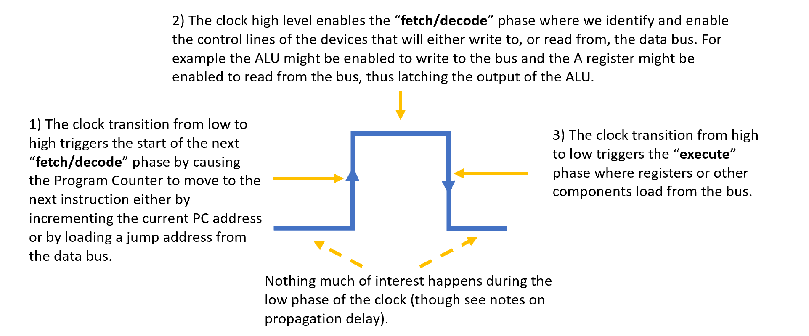

# CPU Timing - This is Not a "_Single Cycle CPU_"

This CPU achieves one instruction per clock cycle. However, this is NOT *"single cycle cpu"* - at least not as I want to define that term.

I feel that many home brew *TTP CPU's* , are not truly single cycle; and this would likely include any CPU that uses asynchronous components link RAM or latches.
You can see my argument against the common use of the term "single cycle cpu" on [stack overflow](https://stackoverflow.com/questions/63693436/is-a-single-cycle-cpu-possible-if-asynchronous-components-are-used) ; also copied to [this local page](single_cycle.md).
Since there is no formal definition of "single cycle cpu" then I will define it as a CPU that achieves one instruction per clock cycle AND where the CPU uses only a single edge of the clock. Look to [this page](single_cycle.md) where I lay explain that second condition.

## CPU Phases

The CPU operates on a single clock cycle with _fetch/decode  on one edge and _execute_ on the other.

The first stage is to load the program counter with the next instruction address, *fetching* the program bytes from ROM and making them available to the decode logic. The PC is updated on the rising edge of the clock. 

The second stage, *decoding* the program bytes into control lines, occurs during the high phase of the clock. During this phase the control lines settle and enable/disable devices determining what will happens to those components at the execute phase.

The third stage, *execute*, occurs on the falling edge of the clock and this is where new values are clocked into registers or into RAM from the ALU data bus.

A hugely significant thing that happens during the high phase of the clock. This is the settling of the combinatorial logic which include the ROM's and decoding logic. The propagation delays of these componets must respected if the CPU is to be stable. The page [Timing Considerations](timing-considerations.md) discusses my learning/thinking on this; there are a bunch of references in there to other work and notes on cross domain clocks etc.

I describe the PC update occuring before the execute but it's up to you which way round you think of it. For example [the instruction cycle described by Oxford University](https://www.robots.ox.ac.uk/~dwm/Courses/2CO_2014/2CO-N2.pdf) states that _"The last part of the fetch is to increment the PC"_. 
