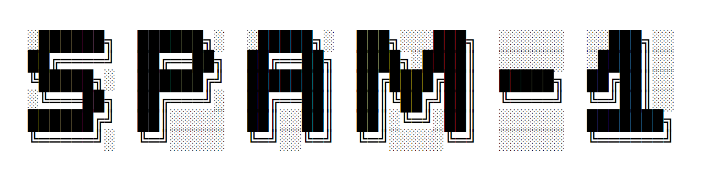

# SPAM-1 CPU - Simple Programmable and Massive

An 8 bit home brew CPU built using 1970's logic chips, with a Verilog simulation, an assembler and a "C" compiler.

- [Source on GitHub](https://github.com/Johnlon/spam-1)
- [Hackaday.IO project](https://hackaday.io/project/166922-spam-1-8-bit-cpu)
- [VBCC C compiler port](https://github.com/Johnlon/spam-1-vbcc)

## Design - Version 1c

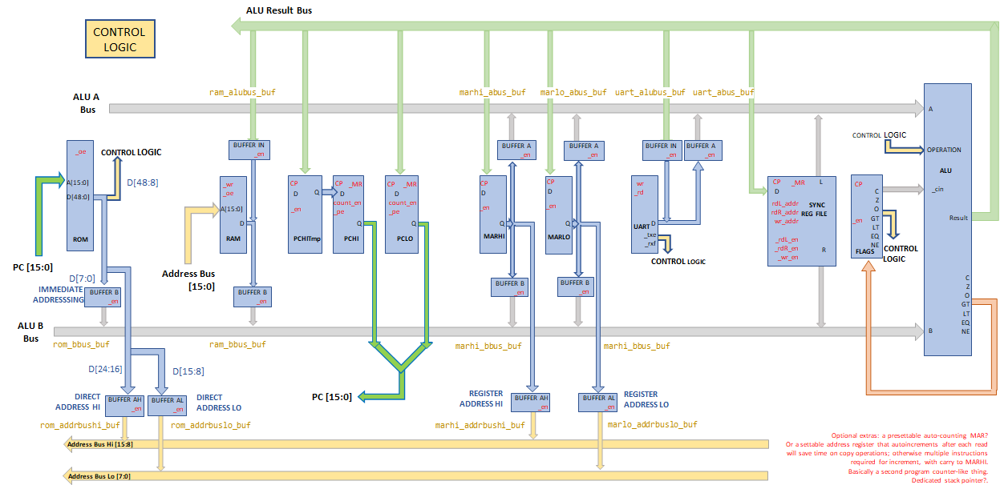

- Five buses
- 8 bits data
- 16 bits address
- 48 bit instruction, read from six 8 bit ROMs in a single clock cycle
- 8 bit ALU - approx 32 arithmetic and logical ops plus magnitude comparisons
- Harvard style separate RAM and program ROM
- Fetch/Decode on one edge of the clock, Execute on the other
- Not microcoded - see [thoughts on microcode](thoughts-on-microcode.md)

See [Previous Versions](previous_versions.md) of the architecture.

## Registers

- Register file : A/B/C/D - general purpose
- Memory Address Register : MARHI and MARLO - general purpose, and also address the RAM in register addressing mode
- Program Counter (PC)
- Status register - Zero, Carry, Negative, Overflow plus comparator flags Eq/Ne/Gt/Lt
- UART for output and input

## Instructions

Every instruction has the same form `T = A ALUOP B [condition]`, for example `MARHI = REGA + REGB`.

- All data transfers go via the ALU.
- A jump is an assignment to the program counter, eg `PC = REGA + $23`.
- Every instruction is conditional, similar to ARM, eg `PC = REGC + REGD _C` executes only if Carry is set.
- Conditions cover the ALU status flags and the UART ready for RX and TX flags.

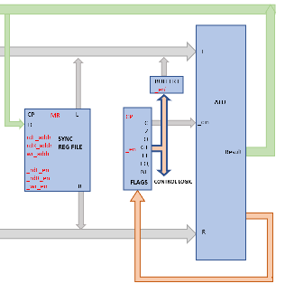

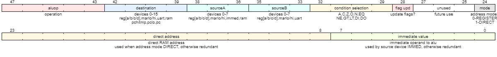

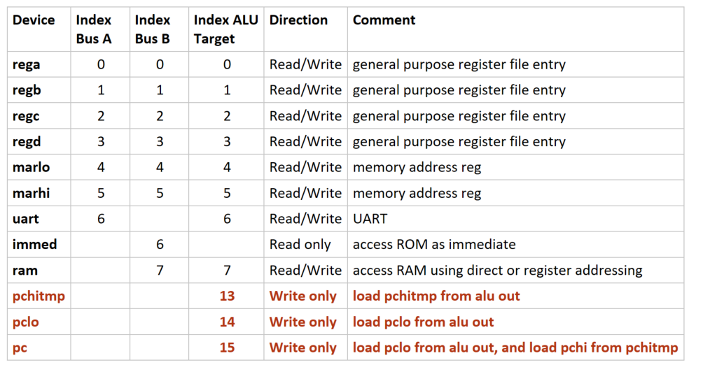

See [instruction bitfield](instruction_bitfield.md) and [single cycle design](single_cycle.md).

## Addressing modes

- Direct - the instruction applies a 16 bit address to the RAM
- Register - MARHI and MARLO address the RAM
- Immediate - an 8 bit value from the ROM is applied to the ALU "B" bus

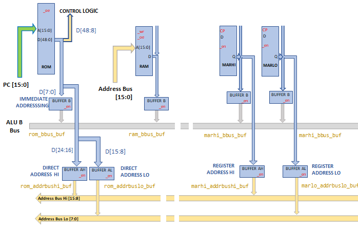

## Hardware Components

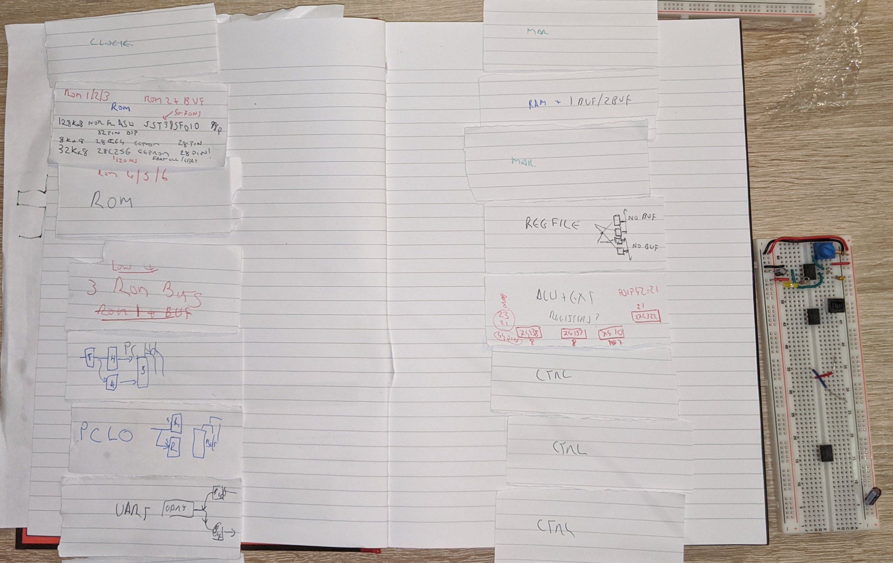

| Component | Board |
|-----------|-------|
| [CPU timing](cpu_timing.md) | |
| [Program Counter](program_counter.md) | 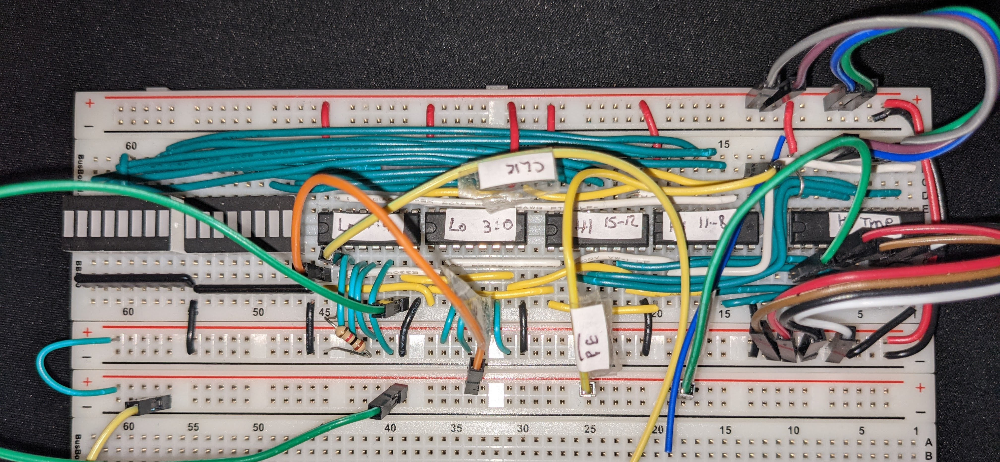 |
| [ALU](alu_with_carry_in.md) | 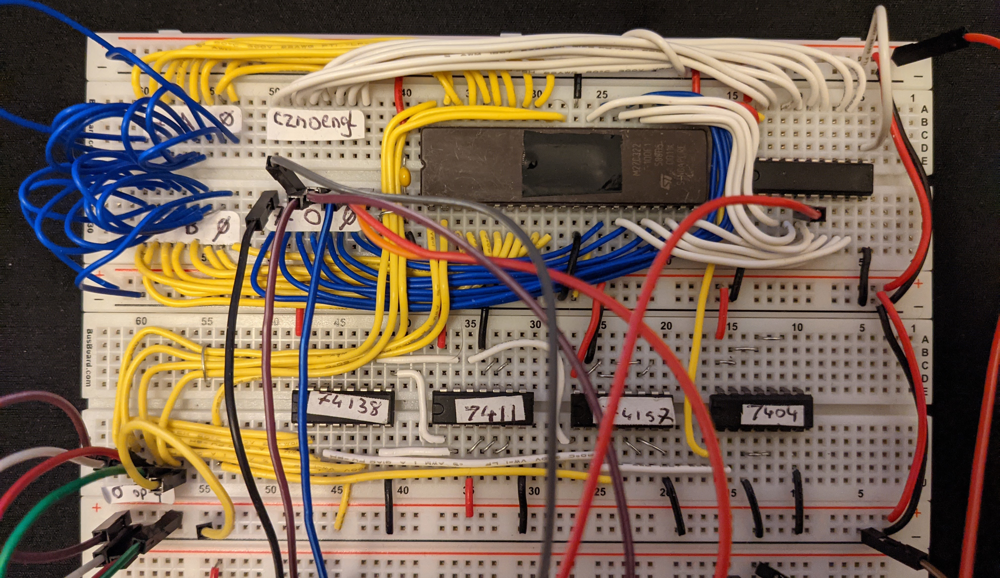 |
| [Status Register](status_register.md) | 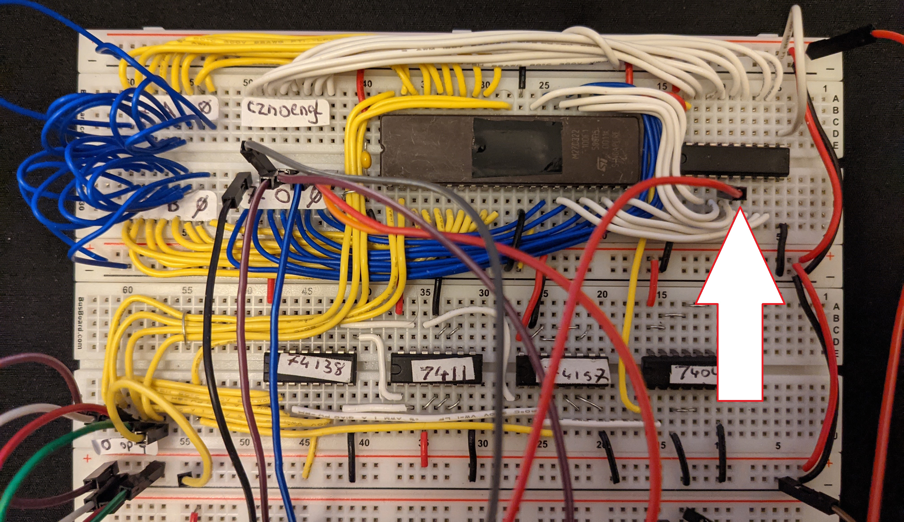 |
| [Register File](register_file.md) | 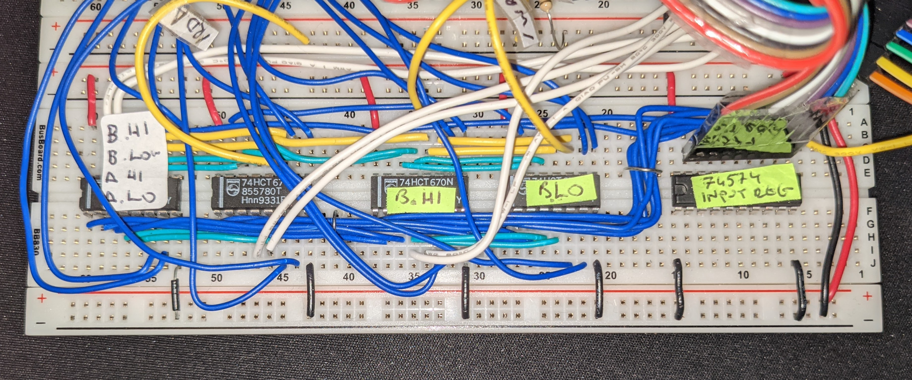 |
| [UART - UM245R](uart.md) | 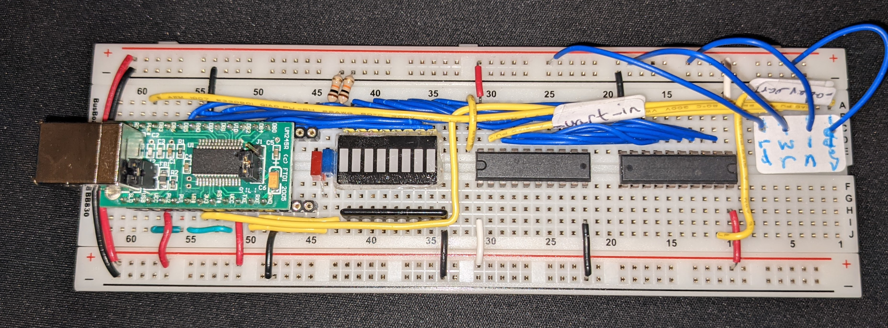 |
| [Memory Address Register](memory_address_register.md) |  |
| [RAM](ram.md) | 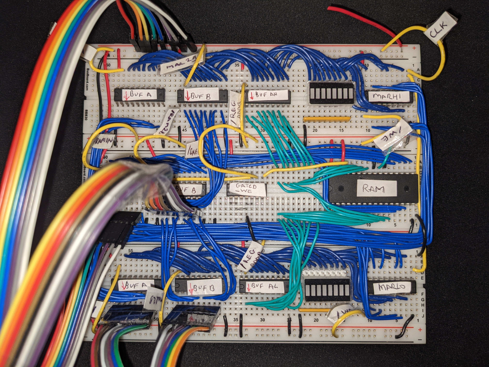 |
| [Program ROM](program_rom.md) | |
| [CPU verilog model](https://github.com/Johnlon/spam-1/blob/master/verilog/cpu/cpu.v) | |
| [Control Logic verilog model](https://github.com/Johnlon/spam-1/blob/master/verilog/cpu/controller.v) | |

## Example - Fibonacci

Subroutine calls using registers for argument passing and return address.

```
; Fib using registers for arg passing

ZERO: EQU 0

start:      REGA    = 1
            REGB    = 1
            PCHITMP = >:ZERO  ; take low byte of label 'ZERO' and write to PCHITMP
            REGC    = REGA

            ; set PC to return address and then call the send_uart loop
            REGD    = >:loop
            PC      = >:send_uart

loop:       REGA    = REGA+REGB  _S
            PC      = >:start _C
            REGC    = REGA

            ; set PC to return address and then call the send_uart loop
            REGD    = >:ret1
            PC      = >:send_uart

ret1:       REGB    = REGA+REGB _S
            PC      = >:start _C
            REGC    = REGB

            ; set PC to return address and then call the send_uart loop
            REGD    = >:loop
            PC      = >:send_uart

send_uart:  PC      = >:transmit _DO
            PC      = >:send_uart    ;loop wait

transmit:   UART    = REGC   ; write whatever is in REGC to the UART
            PC      = REGD   ; jump to the location in REGD
end:

END
```

## Research and Design Notes

- [Timing Considerations](timing-considerations.md)
- [Thoughts on Microcode](thoughts-on-microcode.md)
- [ROM research](rom-research.md)
- [Research and References](references.md)
- [Hardware Components](components.md)
- [Digital Simulators](digital-simulators.md)
