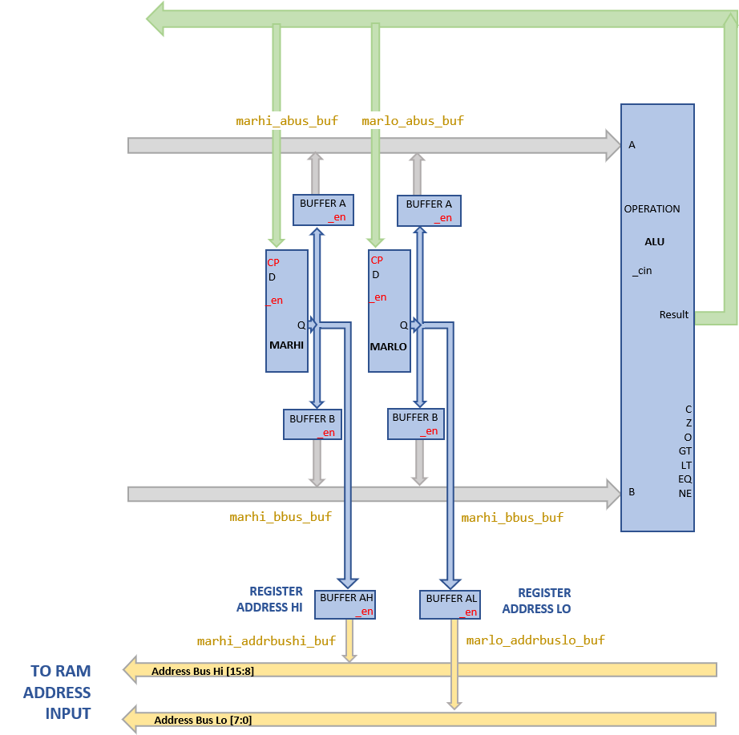

# Memory Address Register

The memory address register in SPAM-1 is a pair of 74HCT377 8 bit flipflops that together comprise a 16 bit memory address register (MAR). The MAR can be used in _register addressing mode_ to reference any RAM location for a read or write operation. 

The MAR registers play a dual and as well as their special purpose for RAM addressing the two 8 bit MAR registers can be used as general purpose registers in ALU operations in the same manner as the [register file](register_file.md). The MAR register can provide an value onto either or both of the ALU input busses.

The MAR operates is constructed as a quadruple port register. Each 8 bit MAR register can be:
- written to by the output of the ALU
- provide a value onto ALU input bus A 
- provide a value onto ALU input bus B
- provide a value onto the RAM memory address bus.

In each case where the MAR flipflops integrate with a bus there is a 74HCT245 tristate buffer chip.

## Verilog Models

- [74HCT377](../verilog/74377/hct74377.v)
- [74HCT245](../verilog/74245/hct74245.v)