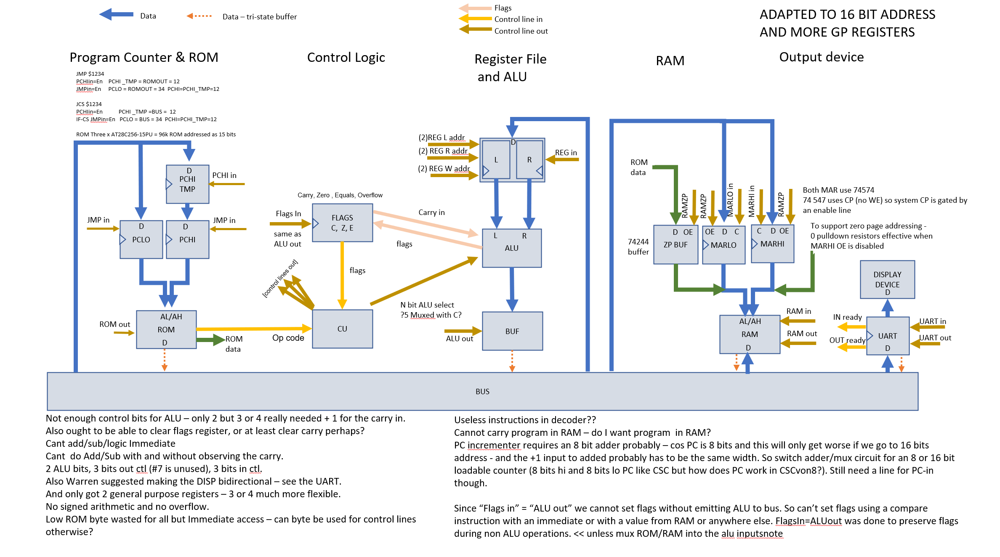

# Previous Versions along the way

## Version 1a

Version 1a had a very simple arch that was easily implementable and for which I wrote a Logisim simulation and also an assembler in GoogleSheets that could be used to program the simulation.

:thumbsup: See the [SPAM-1 Assembler](https://docs.google.com/spreadsheets/d/1lYyPqYNF1dGDRP2n3ablaqkgZuxJ9x6T-ylut_nT1p4/edit?usp=sharing) implemented in Google Sheets.  

However, once I got that far I decided it was rather too simple and limited for me to build. I wanted more of a challenge.
It's now months later and the challence is still brewing, which is a bit of a disappointment.

The original design is shown below but see also the [Original design branch for more info](https://github.com/Johnlon/spam-1/blob/OriginalDesign/README.md)

I spent a couple of weeks building the Logism simulator for this CPU. 
It was 8 bit and based on ideas from various places but kind of grew by itself with a little planning. 
Its was fairly primitive one in that there was no microcoding or higher level instructions, 
or to put it another way it used pure horizontal encoding with dedicated bits in the instruction controlling each device. 

:star: The complete set of instruction and argument combinations were [here](instructions.txt)

- The Logism simulator worked
- The assembler and decoder were written n Googgle Sheets and worked (see below) well 
and I'm was happy with the way the software turned out
- My Fib program counted up and down in a loop

So all good !!

This version was merely Logism sim (see more below).

I've built the assembler in Google Sheets, which I think might be a pretty unique approach (let me know).

 

## Version 1b

This version was a verilog and paper design and was a pretty massive increase in complexity and capability over version 1a.

However while this was definitely more of a challenge I felt the trade off between added complexity and added capability wasn't favourable.

So I decided what was needed was a little bit more technical complexity for a lot more capability. This brought me to the current design.

But as mentioned above it wasn't enough of an functional improvement over version 1a (below) so I let this 
continue to evolve into version 1c

I had started thinking about how to pass ROM or RAM output via the ALU as well as the registers, but I still had a data bus.

Prior to that I extended the address space to 16 bits and started thinking about other approaches to memory addressing.

