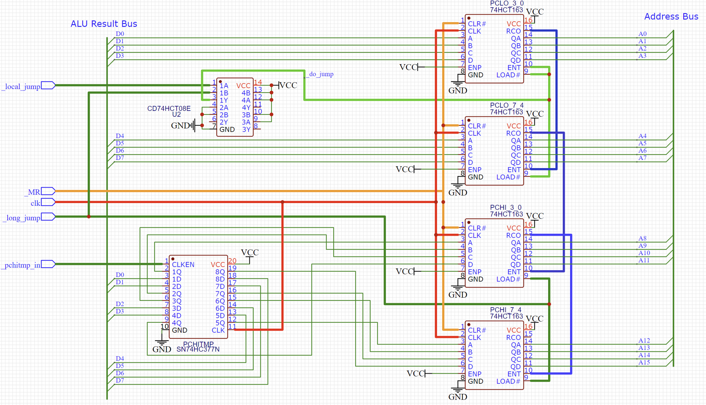
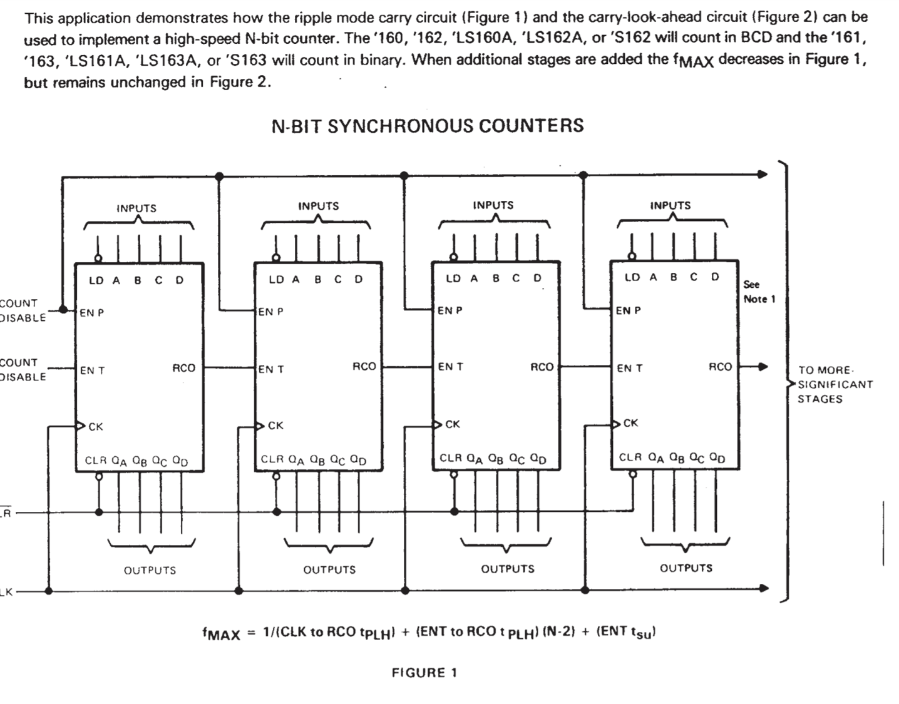

# Program Counter

The program counter is built around a pair of 74HCT163 presettable counters labelled below as PCHi and PCLO and also an 8 bit flipflop labelled PCHITMP that's needed to enable jumps to happen atomically.

A _long jump_, where we load a 16 bit value into the program counter, takes 2 instructions. First the upper 8 bits of the 16 bit address value is loaded into PCHITMP. This temporary register carries the upper 8 bits of the the address that will be loaded when the jump is executed. Secondly, to execute the jump, the lower 8 bits of the jump address are loaded into PCLO. The act of loading PCLO causes the value in PCHITMP to be loaded simultaneously into PCHI. In this way the PC is able to load a new 16 bit value despite the processor having only 8 bit wide data busses.

There is also the option of making a _local jump_ where we load the PCLO register without modifying the PCHI and this option may prove useful in future as an optimisation, where the jump is to an address in the same 256 address page that PCHI is already pointing to. This would save one instruction whenever the jump is within the current program counter page however it requires a bit more effort on the part of the Assembler to decide if this optimisation can be applied and it would definitely be a later enhancement to the software. The hardware carries this capability nonetheless.

The schematic below shows how the counters and registers are hooked up. In addition you can see that there is a 74HCT08 'AND' gate. This AND gate is related to the optional long and short jumps mentioned above. It ensures that the low byte of the PC is loaded whether the update is either a long jump or a local jump.

You can see from the schematic that the progam counter also includes a _master reset_ line. This line allows the PC to be reset to 0. 

All state changes whether it's proloading the 74163's or loading the PSHITMP register or performing a master reset are all performed synchronously; that is, state changes occor only on the clock edge.

# Note on the 74HCT163

The various data sheets for the 74163 don't seem to agree on pin names.

This variation is a bit irritating but it's not unique to this device. In my simulations and documentation I have accidentally used variations on names rather than picking one data sheet and sticking to it.

More irritating is that the data sheets generally don't contain much in the way or useful application notes that show how to use these devices correctly. I could see examples of other projects using them but I wanted some source material.

Eventually I found a data sheet that contained these images and no other info...

Not super helpful, and skimming other projects I could see both variants in use but also variations that I'm not sure were deliberate or the result of years of chinese whispers on how to use these devices.

In any case the SPAM-1 program counter chains the 74HCT163 devices together using the approach 

