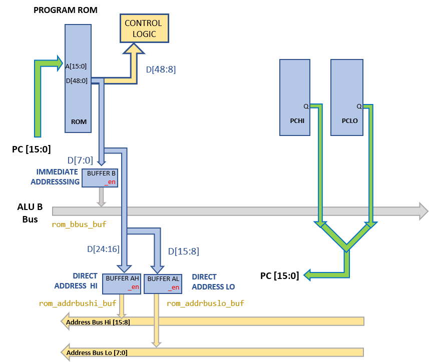

# Program ROM

The SPAM-1 instruction is 48 bits wide and is spread across 6 program ROMS that are used in parallel.

The address lines of the program ROM are hooked up directly to the 16 bit  program counter output.

The program rom supplies:
- configuration to the control logic
- optionally, direct 16 bit RAM addressing 
- optionally, an 8 bit immediate value into the ALU

Connectivity to the ALU or the address bus is via 74HCT245 tristate buffers.

## Verilog Models

- [ROM](../verilog/rom/rom.v) ([Tests](../verilog/rom/test.v))
- [74HCT245](../verilog/74245/hct74245.v) ([Tests](../verilog/74245/test.v))
- [Control logic model containing the Program ROM implementation](../verilog/cpu/controller.v)
