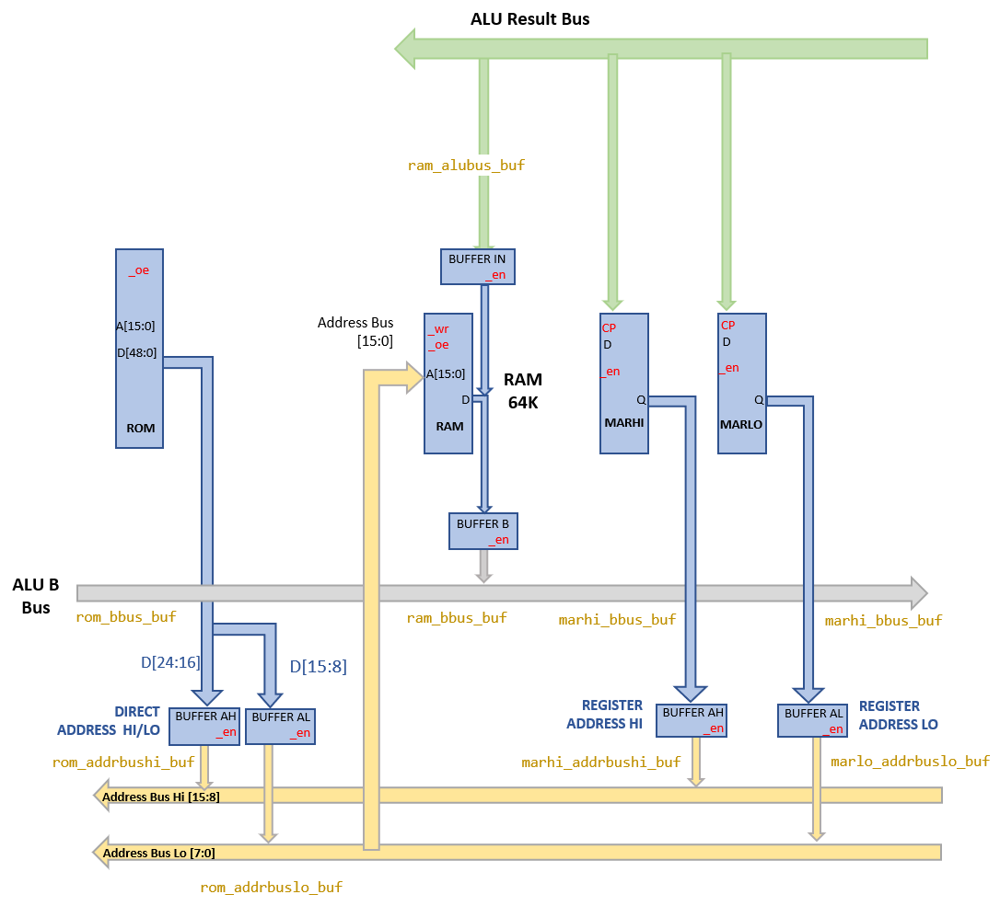

# RAM

SPAM-1's RAM is 64k by 8 bits.

The RAM is written to by data flowing from the ALU result bus. The RAM is connected to the ALU result bus via a tristate buffer (see 'BUFFER IN' above) to avoid interference between the ALU result bus and the ALU B input bus as the RAM's data lines are connected to both the busses. 
When the RAM is read it places a value on the ALU B input bus via a tristate buffer.

The RAM may be addressed in one of two ways:
- _Register addressing_ via the [memory address registers](memory_address_register.md) or
- _Direct addressing_ via an address supplied by the [program ROM](program_rom.md)

Because the RAM emits data only onto the ALU B input B then RAM values may only appear on the right hand side of ALU operations eg `REGA = REGB + RAM[$1234]` 

## Verilog Models

- [RAM](../verilog/ram/ram.v) ([Tests](../verilog/ram/test.v))
- [74HCT245](../verilog/74245/hct74245.v) ([Tests](../verilog/74245/test.v))
