# Register File

The SPAM-1 register file is logically organised as a *4 by 8 bit triple port register file*.

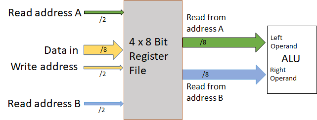

The design calls for the value of any of the 4 registers to be optionally emitted on either or both of the ALU input busses at any instant. This means that the register file cannot simply be composed of four 8 bit flipflop IC's and some additional or alternative circuitry is required.

Instead of using individual flipflop chips I've chosen to use 74HCT670 4x4 regiser file chips organised as shown below.

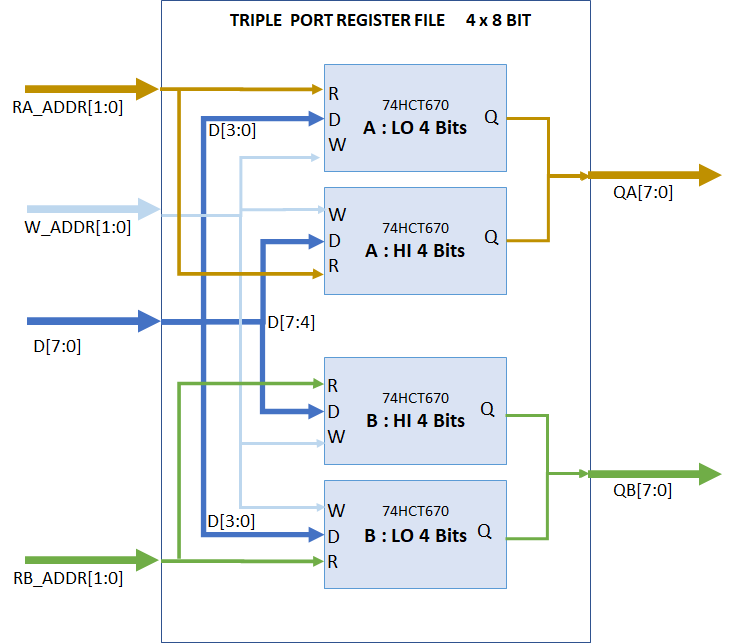

This design provides the functionality with a minimum of effort. 

However, unlike flipflops the 74HCT670 is not edge triggered and this presents a problem for the SPAM-1 implementation. The problem related to uncontrolled feedback loops that would occur if a given address in the register file (ie A/B/C/D) is selected as providing input to the ALU and that same address is selected as the target of the ALU. That situation is ilustrated below.

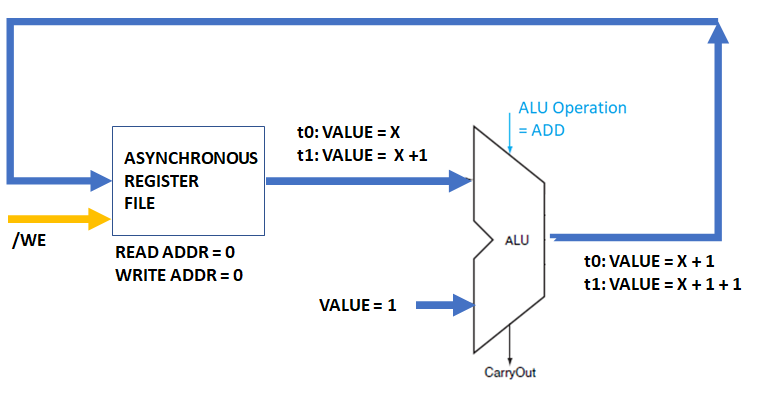

Where all components are combinatorial as shown above, then the output of the ALU flows into the register file and back to the input of the ALU, and on and on. If the ALU operation was seto to a 'plus' operation then we might expect the value are the output of the ALU to count up at a rate limited only by the propagation delays of the devices in that data path. In truth I have no idea whether this would happen in practice and I suspect that we would actually see various non-deterministic values flowing through the data path. In anycase, a circuit that acted in this manner is no use at all to me so something extra is needed.

The simple solution to this problem is to add a synchronous aspect to the register file so that this unconstrained value feedback cannot occur. This is the situation illustrated below.

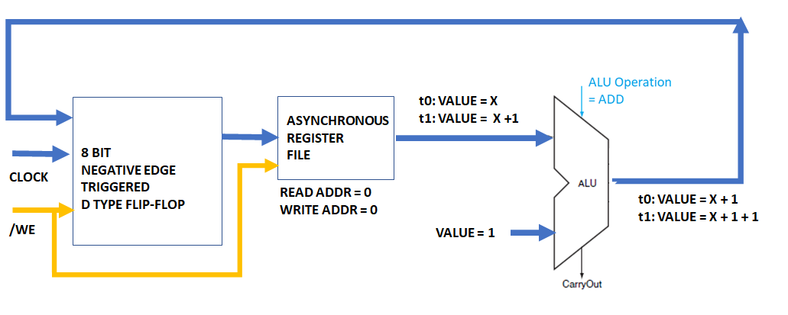

What you can see is that I have added an edge triggered flipflop into the data path into the register file. This new device provides a means to control when new values are accepted from the ALU and it breaks the uncontrolled feedback. 

In this instance some synchronisation of the `clock` and register file `/WE` write enable signals is needed. What is needed is for the clock signal to load a new value into the flipflop and then for the write enable to go low to start witing that value into the selected write address. It is important that the write enable to return high again before the write address changes otherwise more than one register file location will be updated. The timing diagram looks like this.

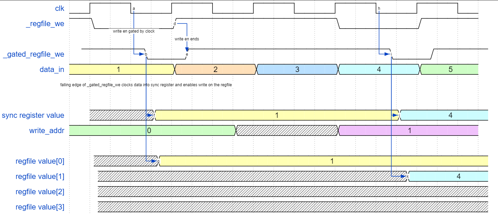

What we have here is a situation where the write enable signal from the control logic is `_regfile_we` and this is gated by the low phase of the clock to produce `_gated_regfile_we`. The `_gated_regfile_we` signal provides a negative edge that is used to clock data into the input flipflop and the low phae of the `_gated_regfile_we` enables write to the selected write address.

In the diagram above we can see that at the first -ve edge of the clock the `_gated_regfile_we` goes low and this clocks the value _1_ off the ALU output (labeled _data_in below) into the synchronous flipflop (see yellow). At the same moment this gated write enable causes this new registered value to enter the register file at `write_addr=0` (which is _REGA_ in the simulations).

The clock then returns high and the write to the register file ends. A couple of clock cycles later the `write_addr` changes to the value _1_ but because the write enable is now high then no accidental register file update occurs. A half cycle later however the clock goes low again when `_regfile_we` is enabled and so a new write occurs at `write_addr=1` (ie REGB) and the data at location `0` (REGA) is left untouched.

The schematic for the register file is shown below. The logic required to create the `_gated_regfile_we` is omitted as it is part of the control logic.

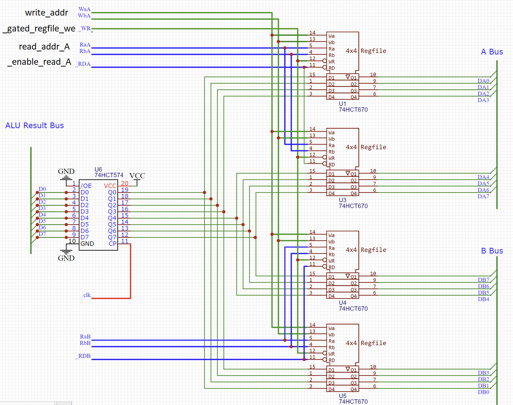

## Alternative Implementations

I mentioned earlier that a register file could of course be created with more primitive components than the 74HCT670; it could be created with some flipflops. Using flipflops would avoid the feedback problem mentioned above but I would still need to contruct a `triple port` module so I need more that just 8 eight bit flip flops.

Some suitable devices might be ...

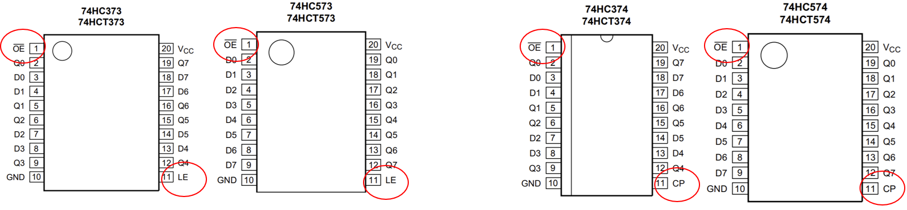

- 74374/74574 are edge triggered and will need to gate a write control line with a clock signal to control which address gets written to.

- 74373/74573 are level sensitive latches and will need external logic to control which register gets updates, but may also need some extra help to work well in a synchronous circuit

See also at my [component page](components.md) that lists lots of different kinds of latches and flipflops for some idea of the various device options available.

However, whilst a flipflop is great for a single standalone register, none of the 74xx flipflop or latch devices alone is a great fit for this triple port register file application. I need an endge triggered device (aka flipflop) that has a write enable input and which has tristate outputs; and I need a binch of address decoding logic on the write and also on each of the reads.

Nevertheless it' interesting to see how one can organise dual port devices (ie one input port and one output port) into triple port arrangements

### Truple Port Modules using Dual Port Components

The diagram below gives a few options that I go into in more detail later.

I didn't use any of these options in the register file because of their complexity, as mentioned below. However, SPAM-1's Memory Address Register (MAR) does use the bottom left pattern as the MAR is a triple port device and I wanted to include an LED array to view the MAR address.

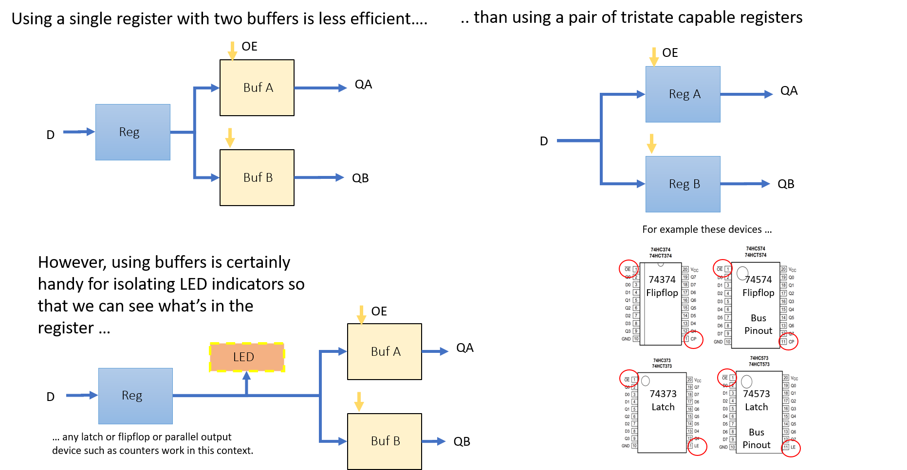

### Use tristate flipflops?

The approach shown below uses flipflops to provided a triple port register file. I would need 8 flipflops that have tri-state outputs to create a _4 by 8 triple port register file_. Additionally, the diagram below indiates that some address decoding logic is needed on the read and write addresses, which adds up to yet more commplexity. 

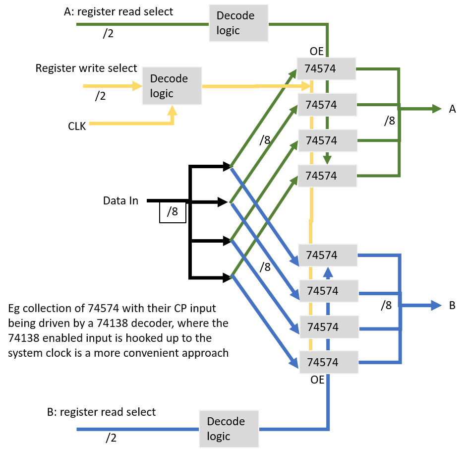

What's not shown below either is that the 74574 for example has a clock input but no _write enable_ so the decoding logic for write is actually even more complicated by the need to gate the clock into each of the flip flops. In short it starts to get complicated. You end up with something like this ...

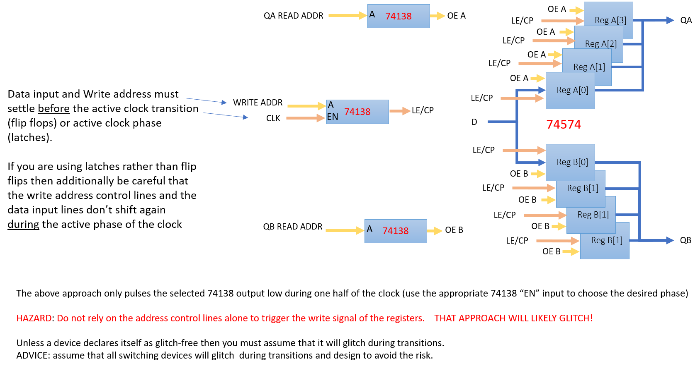

### Use tristates and buffers flipflops?

Alternatively, one could use a mix of flipflops and tristate buffer as shown below. This pattern takes advantage of the individual clock and write enabe inputs of devices like the 74377. But as you can see involves a lot of devices over all.

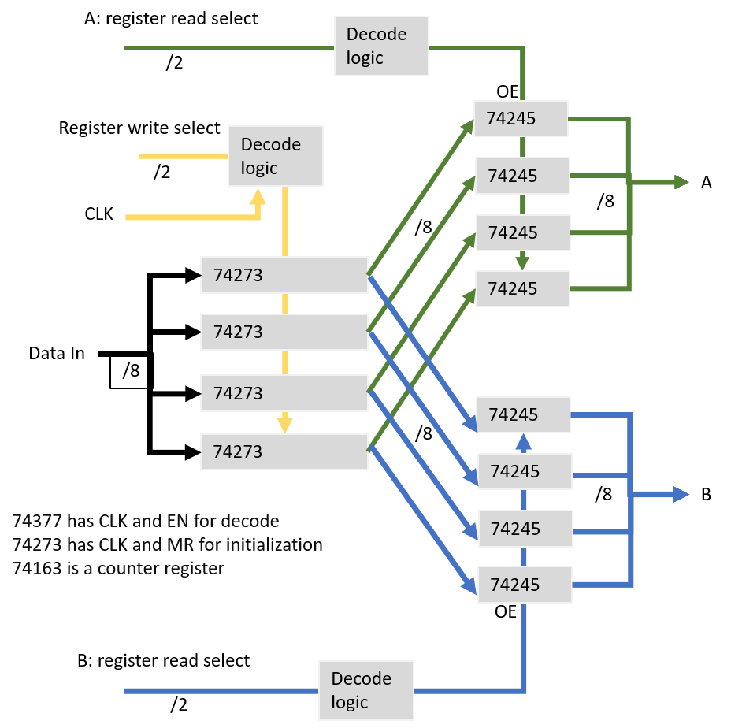

