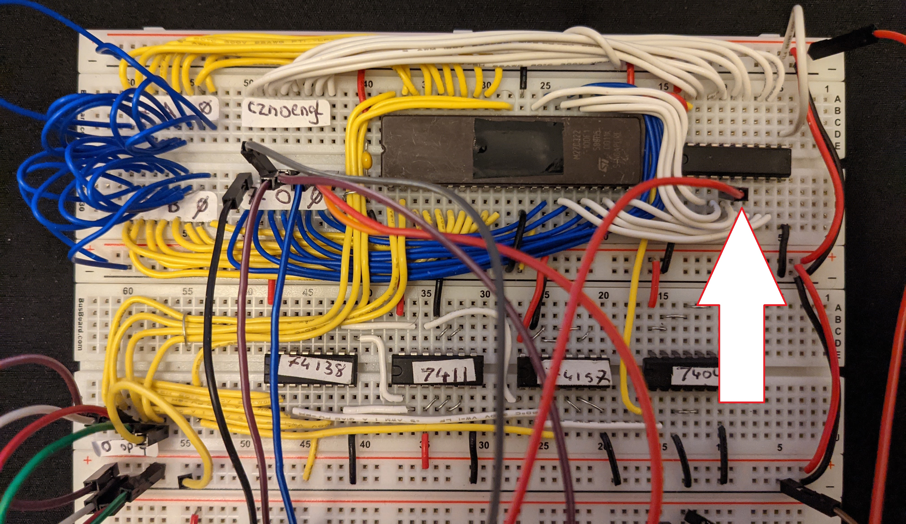
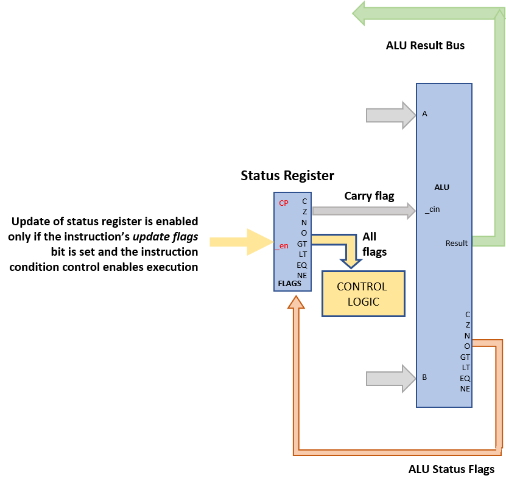
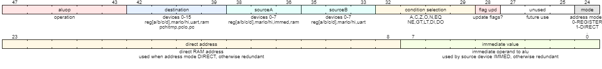

# Status Register

The SPAM-1 status register records the ALU output flags so that subsequent operations may be made conditional on the status of those flags. The status register is implemented using a 74HCT574 flpflop and is hooked up with the ALU and control logic as illustrated here.

The status register contains only the flags that are generated by the ALU. There are two other control flags that come from the UART, _data in ready_ (DI) and _data out ready_ (DO). These flags are not registered but are sent from the UART directly into the control logic.

Whether or not a given instruction atually updates the status register depends on a couple of factors outlined next.

## Status Register Update is Conditional

The SPAM-1 instruction is encoded as shown below.

The _condition selection_ part of the instruction defines whether or not an instruction execution is dependendent on the the value of a flag held in the status register. The special condition value '0' indicates _Always_ and is used to make the instruction execution unconditional.

The _flags upd_ control bit defines whether the status register ought to be updated if/when an instruction executes.

Therefore the status register is only updated by a given instruction if:
- that instruction actually executes AND 
- the _flag upd_ bit of that instruction is set.

Overall, this scheme provides for a flexible coding style. 

## Verilog Models

- [74HCT574](../verilog/74574/hct74574.v) ([Tests](../verilog/74574/test.v))