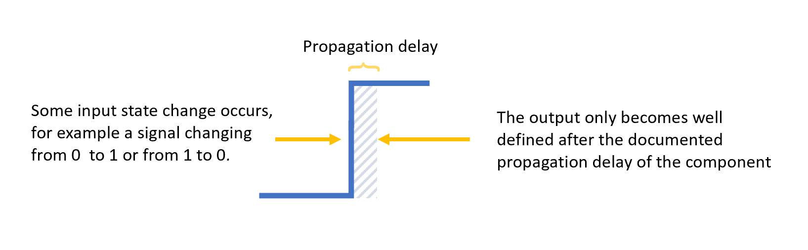
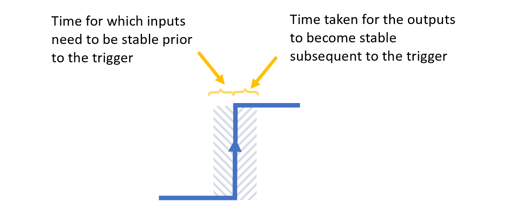
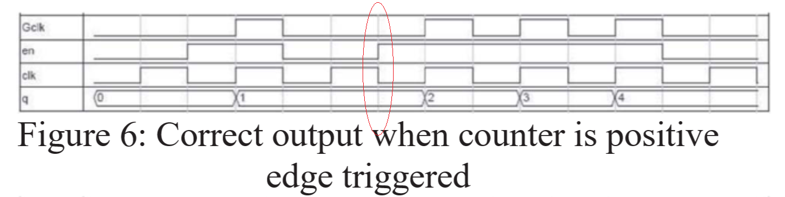

# Timing Considerations

## Propagation Delays

One might at this point ask a question "what limits the speed of a CPU?". In most circuits the speed limit probably comes down to the well documented timing limitations of the components you've chosen to use. To be fair factors such as capacitance, or even inductance, damping out or creating higher frequency signals might complicate things but I haven't the experience to say the extent of the role that capacitance and inductance play in limiting home brew CPU speeds; CPU's that run 10MHz or less. My instincts tell me that capacitance and inductance are unlikely to be a huge concern unless attempting to run at higher frequencies and in any case these factors would probably by highly dependent on the specific layout of one's CPU.

We know that running a home brew CPU in the 1MHz-5MHz range is entirely feasible and it's easy to find folk doing this, such as Warren Toomey and his [CSCvon8](https://github.com/DoctorWkt/CSCvon8/blob/master/Docs/CSCvon8_design.md). 

Why not faster?

State changes in electronics are fast but not instantaneous.  All electronic components have delays around the time needed to setup the inputs of the component and/or delays between an input changing and the output of the component reacting to that change. During these intervals the outputs of the component cannot be relied on to be have a stable and deterministic value and these kinds of delays put a hard limit on how fast one can run a given component.

In addition, many components will state how long the inputs of the device (eg the data in of an latch) must be held stable prior to a trigger or enable signal. If the inputs are not held stable sufficiently long prior to the trigger then the data seen by the device is unpredictable; ie potentially random behaviour.  

When we put several components together in a circuit then the individual delays of the component sum up on the _critical path_ of the larger circuit to further reduce the maximum operating frequency of the circuit as a whole.   

For example, consider the logic around an instruction that latches a constant from the program memory into a register. The program memory, eg a ROM, will have associated control logic around it and the output of the ROM will be loaded into a register and all those components will have their own delays. 

For example, lets say the control logic, a [74HCHCT151](https://assets.nexperia.com/documents/data-sheet/74HC_HCT151.pdf) multiplexer, takes 25ns to stabilise the output enable flag on the ROM, the ROM, a [AT28C256-15](https://www.mouser.co.uk/datasheet/2/268/doc0006-1108095.pdf), takes 150ns to display the new data value and finally the register, a [74HCT374](https://www.ti.com/lit/ds/symlink/cd74hc574.pdf), takes 12ns to latch the ROM output, then the critical path through those components is 187ns. In this case then the fastest one could expect to operate this path would be of the order of 5.3Mhz ( = 1 divided by 0.000,000,187). 

And depending on the choice of components this max clock rate could be considerably less. For example, if instead we choose the slower [AT28C256-35](https://www.mouser.co.uk/datasheet/2/268/doc0006-1108095.pdf) ROM then we are looking at a tACC (time from address to data output stabilisation) or tCE  (time from chip enable to data output stabilisation) of 350ns, which would mean a max frequency of no more than 1/(25+350+12) = 2.5Mhz approx.

All the calcs above are approximations from the data sheets (which I may have misread) but the principal stands that longer delays in the individual components translate to lower operating frequencies for the CPU. 

If one uses a more sophisticated simulation or modelling tool than Logisim then the tool will probably calculate your critical path for you and tell you the timings. The critical path is the slowest path and thus the path likely with the greatest impact on speed.

Most of the time I figure you can work it out roughly like I have above and then decide if you want to make adjustments to your design. 

One significant improvement to the 150ns ROM example given above might be have the ROM contain a simple boot program that copies the program code from ROM into a much faster SRAM chip at power-on and then run the program entirely from the SRAM. For example, it is easy to find [32Kx8 SRAM chips with 20ns read cycle time](https://www.mouser.co.uk/datasheet/2/464/IDT_71256SA_DST_2014113-1485479.pdf) instead of the 150ns EEPROM and this might get the CPU clock up to speeds closer to 10MHz. I've not tested that yet of course, but you get the idea.

More info on propagation delays can be found in the [MIT Computational Structures](https://computationstructures.org/lectures/cmos/cmos.html#14) lecture notes which are quite detailed.
And, of course, don't forget to look in your data sheets.

## A word about letting the control lines settle

Se we know that components have propagation delay and that the output of the component is undefined or unpredictable during this "settling" interval.  

Don't allow anything that might mutate the state of the system occur during the settling interval. 

A particular case that has caught a few folk out is accidentaly or deliberately performing some edge triggered action on the same edge that modifies the combinatorial logic, eg attempting to use the output of a ROM at approximately the same instance as changing the address lines of the ROM. It is generally ok to have combinatorial logic attached to other combinatorial logic, as given enough time the state will settle to a deterministic state, but it is generally a bad idea to have synchronous logic in the mix unless the clocking of that synchronous logic is sufficiently late such that the combinatorial input logic has settled.

Ben Eater's CPU is reputedly succeptible to issues in this space and one experimenter David Courtney spent several videos trying to work out why his CPU was unreliable and generated spurious control signals. The problems start in his "Reset Switch" video where [David makes the observation that a spurious "47" was coming up on his display](https://youtu.be/NnNQJoNzTM4?t=85). The problems David experienced were a direct consequent of using a synchronous component in an unsafe manner where the clock to the component was receiving phantom pulses generated by the random fluctuations of the combinatorial logic as it was settling (and we know already this spurious signals ought to be expected). 
David's [solution 4 videos later](https://www.youtube.com/watch?v=N3rDMHvDhXM&t=623s) is to swap out the component for one that had an enable line and this allowed him disable latching during the settling period.

## Clock Domain Crossing

If interested in clocks and timing then you should also take a look at [Warren Toomey's answer](https://minnie.tuhs.org/Blog/2019_07_17_CSCon8_timing_notes.html) to a question I posed him on clock timing where he goes into a lot of useful and interesting details (thanks). 

However, Warren also pointed me to a page about ["Clock Domain Crossing"](https://zipcpu.com/blog/2017/10/20/cdc.html) which contains warning about probles that actually hit me a while back when I was doing something "clever" with dividing my clock. I did it badly and started experiencing an issue where I got two clock pulses when expecting only one. Actually, this was probably similar to the problem David Countney experiences. I had figured out on my own that my stupid divider wasn't reliable and generated spurious clock pulses, but I didn't have any clue what the technical term mihgt be for my mistake. I am now wiser thanks to Warren and I advise you to also visit that link.

The comments section in one of Ben Eater's vids contains a bunch of folk talking about why he didn't just "gate the clock" or something like that, as it would have been easier.  

I paraphrase the whole thing as **"don't mess with the clock!"**.

## Clock Gating

I'd prefer not to mess with the clock. If I'm using a chip like the 8 bit register [74HC377](https://assets.nexperia.com/documents/data-sheet/74HC_HCT377.pdf) which has a LE (latch enable) and clock then I can bring LE high to disable the input to the latch. 

But what if I'm using [74HC574](https://assets.nexperia.com/documents/data-sheet/74HC_HCT574.pdf) which is also an 8 bit register which is similar to the 74574 but swaps the LE for OE (output enable). If I need control over whether data is clocked into this chip then the only option left to me is to gate the clock.

One of the main things to avoid with clock gating is the problem of creating spurious clock signal. Whether there is a risk of this depends on the method taken for the gating and the relative timing of the raw clock versus the other signals with which you are gating the raw clock.

Whilst a spurious clock may or may not be a problem when latching it is more likely to cause an issue with a counter, such as in the program counter or within a microcode circuit's timing. Having the counter advance unexpectedly and with an extremely short duty cycle would likely cause a malfunction including violating timing constraints of other components within the overal circuit. 

A common case is where the clock is ANDed with some other control signal - I need to do exactly this in a register file I'm designing because I'm using 74HC574 which doesn't have a LE input. I need the 74HC574 for it's tristate output which means I need to compromise on the clock gating. It a question of reducing the complexity. But now I'm worried about gating effects. A spurious clock might make me latch the wrong value. Surely AND won't cause a problem? 

The paper 
[A Review of Clock Gating Techniques](ijetmas.com/admin/resources/project/paper/f201503041425478178.pdf
) covers a few of the approaches and the first option discussed is a "simple" AND gated approach. The paper demonstrates how the relative timing aspect can cause spurious triggers.

Even with this paper I wondered whether this figure was correct, whether a hazard had been missed. Below I've highlighted the transition I'm concerned about in this extract. 

 _(taken from [A Review of Clock Gating Techniques](ijetmas.com/admin/resources/project/paper/f201503041425478178.pdf))_

It seems to me that there is a risk that this transition might cause a spurious clock on _Gclk_. This might happen if the _en_ went high moments before the fall of the raw _clk_. Whether or not this potential glitch occurs in practice depends on the derivation of the _en_. In a CPU the _en_ signal might be generated from some combinatorial logic and is likely to lag the _clk_ due to propagation delays, in which case the problem I'm concerned about wouldn't happen. Timing matters.

# Advice on clocks for newbies

Please also go and read the ["Rules for new FPGA designers"](
https://zipcpu.com/blog/2017/08/21/rules-for-newbies.html) page regardless of whether you are planning an FPGA or discrete IC based design. This page is linked off the [Clock Domain Crossing](https://zipcpu.com/blog/2017/10/20/cdc.html) page that I mentioned earlier.

You'll see immediately that I (also Ben Eater and others) violate rule 2 by having the PC advance on one edge and the execution firing on the other edge. In fact that same page says that this setup  _"acts like separate clocks"_, which I agree with. They act like inverse clocks and [Ben Eater even says we need inverse clocks](https://www.youtube.com/watch?v=X7rCxs1ppyY&t=4m29s) in one of his vid's. The important point is knowing what the options are and the pro's and con's then making an informed decision (and simulating first !!!).

Like myself, Warren Toomey also had a signal glitch problem in the Crazy Small CPU build that was resolved by bringing the clock signal into the logic. He discusses the problem in [Crazy Small CPU #13 at about 2m27s](https://youtu.be/Tx9Ote9fMEI?list=PL9YEAcq-5hHIJnflTcLA45sVxr900ziEy&t=126). The approach of brining in the system clock is also cited on the newbie advice page as a potential solution to such problems.

The same newbie advice page gives useful guidance on synchronising buttons and other external inputs with the system clock. Coincidentally the need to synchronise a button press with the system clock came up recently where I had to synchronise the system reset button with the program counter logic and I needed to achieve this by use of a SR latch.

